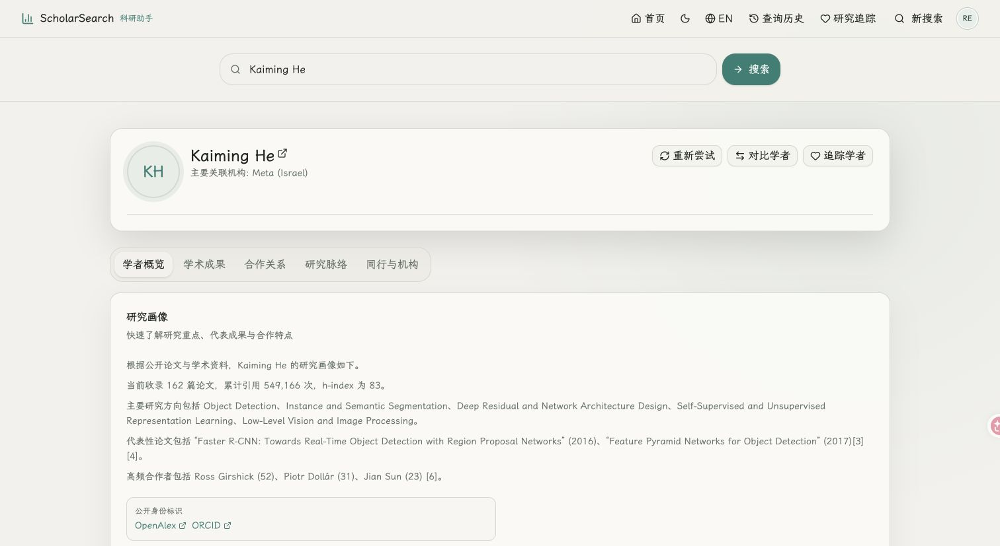
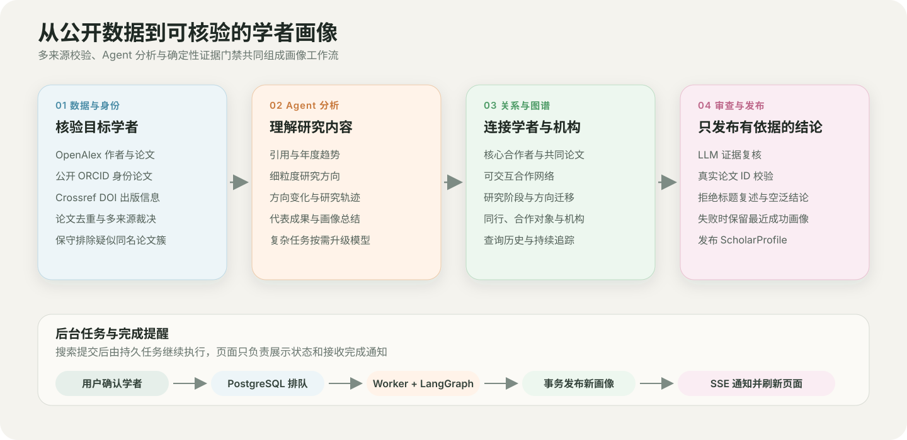

# ScholarSearch 科研助手

ScholarSearch 是一个面向教师、学生和科研团队的学者情报平台。它不只检索论文，而是围绕**作者、论文、机构、研究方向、合作关系和时间线**生成可核验、可比较、可持续追踪的学者画像。

## 平台功能

| 功能 | 可以解决的问题 |
|---|---|
| 学者画像 | 快速了解研究方向、代表成果、影响指标和近期变化 |
| 学术成果 | 按年份、方向和引用查看论文，并回到公开来源核验 |
| 合作关系 | 查看核心合作者、共同论文和可交互合作网络 |
| 研究脉络 | 理解研究阶段、方向迁移以及问题—方法—贡献演进 |
| 同行与机构 | 先展示已完成分析的 20 位候选，并可继续分页查看全部已发现同行；未就绪候选先展示基础信息 |
| 对比与追踪 | 对比两位学者，保存查询历史，并持续跟踪最新研究进展 |

## 页面展示

### 平台首页


### 学者画像



## 工作流设计



一次画像生成主要经过四个阶段：

1. **身份与数据核验**：联合 OpenAlex、公开 ORCID、Crossref 和 DBLP，按 DOI/题名年份核对并保守处理同名学者；如果作者档案缺失，系统还会从精确匹配论文的署名、机构、DOI 与合作者生成待确认候选。配置 SerpApi 后，Google Scholar 会先用系统已有论文锚定作者档案，再核对当前论文集；不配置时自动跳过。
2. **Agent 学术分析**：协调 Agent 根据当前证据动态拆分代表作、合作、机构与研究延续性任务，并行交给专业 Worker 分析。
3. **关系与图谱生成**：构建合作网络、研究脉络，并发现同行、合作对象和相关机构。
4. **证据审查与发布**：审查 Agent 将问题返回总结 Agent 修改并再次审核；达到循环上限后仍由确定性门禁决定发布，失败时保留最近一次成功画像。

画像由后台 Worker 持续执行。查询进入队列后，页面可正常切换；任务完成时通过 SSE 通知前端并加载最新结果。
研究脉络与同行机构会在画像打开后空闲预取；重复切换页签复用已有结果，并在后台按退避节奏检查更新。

## 设计原则

- **准确优先**：身份冲突时宁可提示画像可能不完整，也不混入疑似他人的论文。
- **结论可追溯**：方向、变化和合作判断尽量关联到真实论文、作者和来源记录。
- **模型不替代证据**：LongCat Agent 优先负责理解与归纳，失败时自动回退 DeepSeek，确定性规则负责校验和发布门禁。

## 技术架构

| 层级 | 技术 |
|---|---|
| 前端 | React 19、Vite、TypeScript、Tailwind CSS |
| API | FastAPI、SQLAlchemy、Server-Sent Events |
| 工作流 | LangGraph、多 Agent 路由、独立 Worker |
| 数据 | PostgreSQL、OpenAlex、Crossref、公开 ORCID、DBLP；可选 Google Scholar |
| 模型 | LongCat-2.0 优先、DeepSeek 回退 |
| 部署 | Docker Compose、Caddy、Nginx、Alembic |

生产前端通过 Docker 内置 DNS 动态解析 Web 服务；后端容器增量重建和 IP 变化不会要求手动重启前端代理，前端健康检查同时验证 `/api/ready`。

## 快速启动

```bash
cp .env.example .env
# 按注释填写数据库密码、OpenAlex 和可选 LLM 配置
./deploy/deploy.sh
```

启动后访问 `.env` 中的 `PUBLIC_APP_URL`。普通用户可自行注册；用户名支持中英文、大小写字母和内部空格，密码至少 8 位。

本地开发：

```bash
npm install
# 当前后端依赖要求 Python 3.10+，以下以 python3.13 为例
python3.13 -m venv backend/.venv
backend/.venv/bin/pip install -r backend/requirements.txt
npm run db:up
npm run db:migrate
cd backend && .venv/bin/python -m uvicorn main:app --reload --port 5800
# 另一个终端
npm run dev
```

生产环境必须使用正式域名、HTTPS 和安全 Cookie；不要用公网 HTTP 承载账号密码或用户凭据。

## 测试

```bash
npm run test
npm run lint
npm run build
npm run test:db
```

更完整的产品边界、数据模型和部署说明见：

- [产品说明](docs/PRODUCT.md)
- [系统架构](docs/ARCHITECTURE.md)
