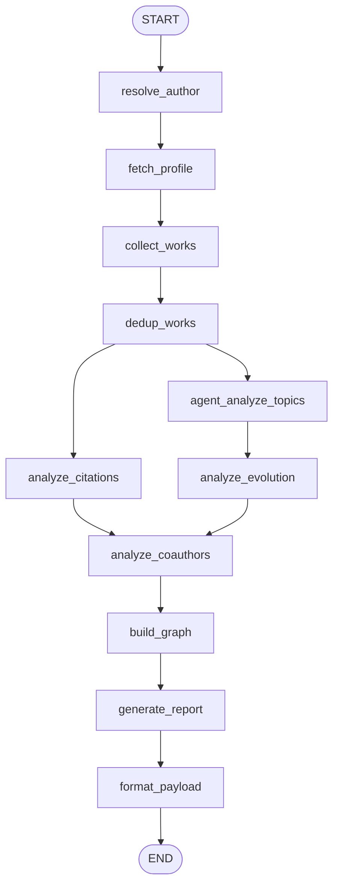

# 学者画像系统 Scholar Profile

一个基于 OpenAlex 的学者画像 Web 应用。用户搜索学者姓名，选择候选人后，系统生成论文统计、引用影响力、研究方向、代表论文、合作网络和学术总结。

## 界面展示

检索过程展示了用户输入学者姓名后，系统调用 OpenAlex 搜索并返回候选学者列表，用户可以根据机构、论文数、引用数和 h-index 选择目标学者。


学者画像概览展示基础信息、总论文数、总引用数、h-index、研究方向标签和系统生成的学术总结，适合快速了解学者整体情况。


合作图谱网络展示目标学者与高频合作者之间的关系，节点代表学者，边的权重代表合作论文数量。


点击合作边后，右侧面板会展示两位学者之间的合作论文列表，便于追溯合作关系的具体依据。


## 技术选型

| 模块 | 技术 |
|------|------|
| 前端 | Vite、React、TypeScript、Tailwind CSS v4 |
| UI | shadcn/ui 风格组件、Radix primitives、lucide-react |
| 网络图 | vis-network、vis-data |
| 后端 | FastAPI、Uvicorn |
| 工作流 | LangGraph |
| 数据源 | OpenAlex |
| 历史缓存 | SQLite |
| 可选 LLM | LangChain OpenAI 兼容接口 |

## 功能

- 学者姓名搜索与 OpenAlex 候选人去重。
- 选择候选人后生成完整学者画像。
- 统计论文数、引用数、h-index 和年度趋势。
- 分析研究方向、代表论文和兴趣演化。
- 构建合作作者网络，支持点击节点或边查看合作论文。
- 画像生成时显示流式进度、百分比和阶段消息。
- SQLite 缓存已查询过的画像，再次查询同一 author_id 可快速返回。
- 支持暗色模式、主题色切换和中英文切换。

## 工作流设计

后端使用 LangGraph 编排画像生成流程。`/api/profile` 和 `/api/profile/stream` 在进入图之前会先检查 SQLite 历史缓存；缓存未命中时运行下方编译图。


上图由已编译的 LangGraph 图生成，等价流程如下：



## 本地启动

### 1. 安装前端依赖

```bash
npm install
```

### 2. 安装后端依赖

```bash
cd backend
python3 -m venv .venv
source .venv/bin/activate
pip install -r requirements.txt
cd ..
```

### 3. 启动后端

```bash
./start.sh backend
```

后端默认运行在 `http://127.0.0.1:5800`。

### 4. 启动前端

另开一个终端，项目根目录执行：

```bash
npx vite --port 5173
```

前端默认运行在 `http://localhost:5173`，Vite 会把 `/api` 代理到 FastAPI 后端。

## 可选环境变量

不配置 LLM 时，系统会自动回退到基于 OpenAlex concepts 的规则分析。

```bash
export LLM_API_KEY=你的密钥
export LLM_BASE_URL=https://api.openai.com/v1
export LLM_MODEL=gpt-4o-mini
```

SQLite 默认路径为 `backend/data/scholar_history.sqlite3`，可通过下面变量调整：

```bash
export SCHOLAR_PROFILE_DB=/absolute/path/scholar_history.sqlite3
```

## API 概览

| 接口 | 方法 | 说明 |
|------|------|------|
| `/api/health` | GET | 健康检查 |
| `/api/search?name=...` | GET | 搜索候选学者 |
| `/api/profile` | POST | 返回画像数据，优先读取 SQLite 缓存 |
| `/api/profile/stream` | POST | NDJSON 流式画像生成进度和结果 |
| `/api/history?limit=20` | GET | 查询最近生成过的画像历史 |

## 验证

```bash
npm run build
npm test
```

`npm test` 会进入 `backend` 并运行 pytest。

## 目录结构

```text
backend/
  main.py        # FastAPI 路由、流式进度、缓存接入
  workflow.py    # LangGraph DAG
  nodes.py       # 工作流节点实现
  openalex.py    # OpenAlex 客户端
  storage.py     # SQLite 历史缓存
src/
  App.tsx        # 前端主界面
  api.ts         # API 与流式响应消费
  components/    # UI 与合作网络组件
img/
  界面截图
```
