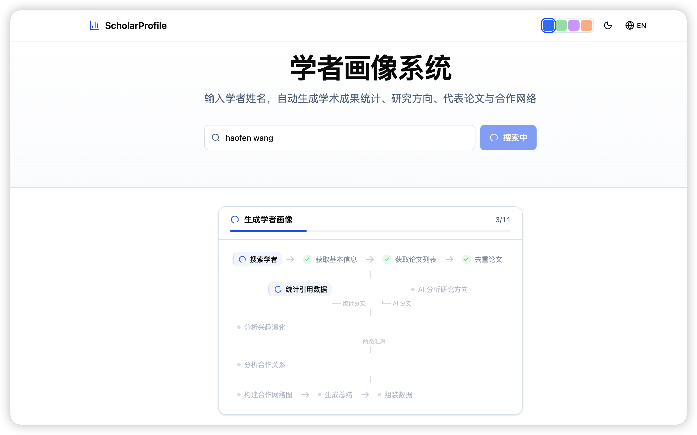
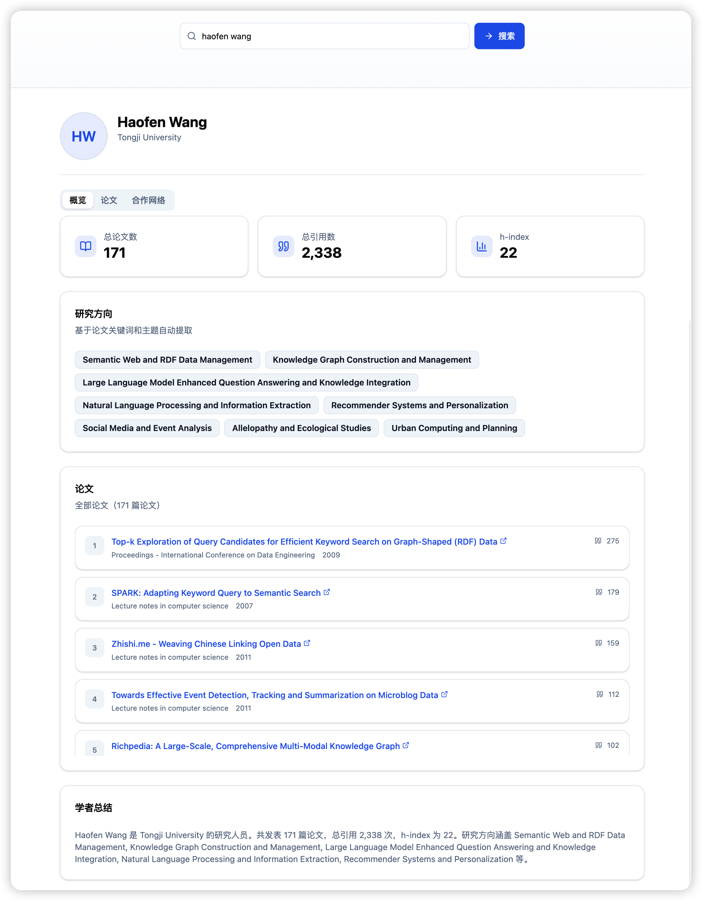
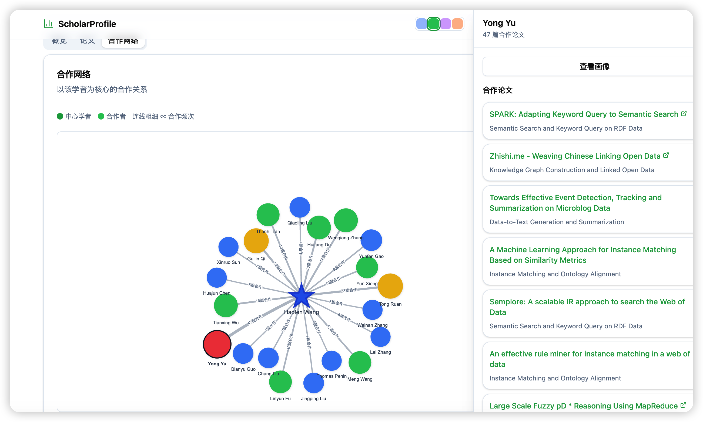
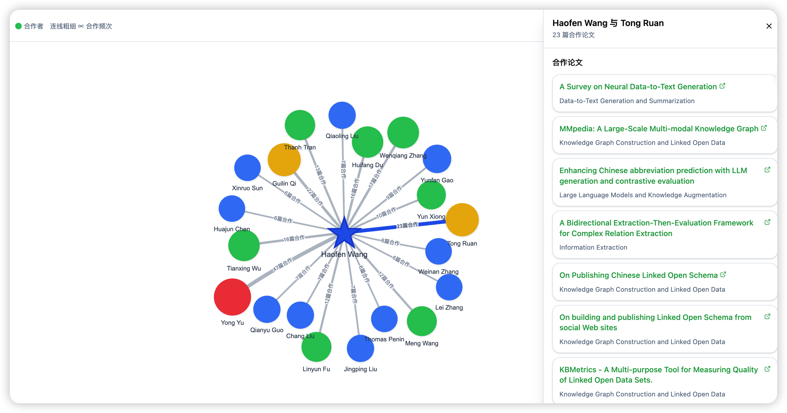
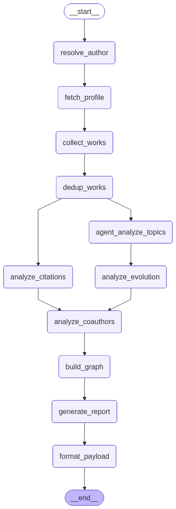

# 学者画像系统 Scholar Profile

一个基于 OpenAlex 的学者画像 Web 应用。用户搜索学者姓名，选择候选人后，系统生成论文统计、引用影响力、研究方向、代表论文、合作网络和学术总结。

## 界面展示

检索过程展示了用户输入学者姓名后，系统调用 OpenAlex 搜索并返回候选学者列表，用户可以根据机构、论文数、引用数和 h-index 选择目标学者。



学者画像概览展示基础信息、总论文数、总引用数、h-index、研究方向标签和系统生成的学术总结，适合快速了解学者整体情况。



合作图谱网络展示目标学者与高频合作者之间的关系，节点代表学者，边的权重代表合作论文数量。



点击合作边后，右侧面板会展示两位学者之间的合作论文列表，点击文章列表可以跳转到对应的 OpenAlex 官方查看原文，便于追溯合作关系的具体依据。



## 技术选型

| 模块 | 技术 |
|------|------|
| 前端 | Vite、React、TypeScript、Tailwind CSS v4 |
| UI | shadcn/ui 风格组件、Radix primitives、lucide-react |
| 网络图 | vis-network、vis-data |
| 后端 | FastAPI、Uvicorn |
| 工作流 | LangGraph |
| 数据源 | OpenAlex |
| 历史缓存 | SQLite |
| 可选 LLM | LangChain OpenAI 兼容接口 |

## 功能

- 学者姓名搜索与 OpenAlex 候选人去重。
- 选择候选人后生成完整学者画像。
- 统计论文数、引用数、h-index 和年度趋势。
- 分析研究方向、代表论文和兴趣演化。
- 构建合作作者网络，支持点击节点或边查看合作论文。
- 画像生成时显示流式进度、百分比和阶段消息。
- SQLite 缓存已查询过的画像，再次查询同一 author_id 可快速返回。
- 支持暗色模式、主题色切换和中英文切换。

## 工作流设计

后端使用 LangGraph 编排画像生成流程。`/api/profile` 和 `/api/profile/stream` 在进入图之前会先检查 SQLite 历史缓存；缓存未命中时运行下方编译图。



### State 设计

LangGraph 使用 `ScholarProfileState` 作为全局状态。每个节点只返回自己新增或更新的字段，LangGraph 将这些字段合并回状态后传递给后续节点。

| 状态分组 | 字段 | 说明 |
|------|------|------|
| 用户输入 | `query_name`, `optional_institution` | 搜索姓名和可选机构约束 |
| 学者身份 | `candidate_authors`, `target_author_id`, `target_author_profile` | 候选作者、用户选中的 OpenAlex author id、作者详情 |
| 论文数据 | `raw_works`, `deduped_works` | OpenAlex 原始论文列表和去重后的论文列表 |
| 引用分析 | `citation_summary` | 总论文数、总引用数、h-index、年度趋势 |
| 研究方向 | `topic_clusters`, `representative_papers` | 方向聚类和每个方向的代表论文 |
| 兴趣演化 | `interest_timeline` | 按年份统计的研究方向变化 |
| 合作网络 | `coauthors`, `graph_nodes`, `graph_edges` | 合作者统计和前端网络图数据 |
| 最终输出 | `profile_summary`, `web_payload` | 学术总结和前端最终渲染载荷 |
| 运行信息 | `warnings`, `errors` | 工作流警告和错误信息，其中 `warnings` 使用 LangGraph reducer 追加合并 |

### 节点职责

| 节点 | 主要输入 | 主要输出 | 负责的任务 |
|------|------|------|------|
| `resolve_author` | `query_name`, `target_author_id` | `candidate_authors` | 搜索候选学者；如果已传入 `target_author_id` 则跳过搜索 |
| `fetch_profile` | `target_author_id` | `target_author_profile` | 获取 OpenAlex 作者详情 |
| `collect_works` | `target_author_id`, `target_author_profile` | `raw_works`, `warnings` | 分页获取作者全部论文，并记录数量不足等警告 |
| `dedup_works` | `raw_works` | `deduped_works`, `warnings` | 按 DOI 或 OpenAlex work id 去重 |
| `analyze_citations` | `deduped_works` | `citation_summary` | 计算论文数、引用数、h-index 和年度趋势 |
| `agent_analyze_topics` | `deduped_works` | `topic_clusters`, `representative_papers`, `warnings` | 调用 LLM Agent 分析研究方向和代表论文；失败时回退到 concepts 规则聚合 |
| `analyze_evolution` | `deduped_works`, `topic_clusters` | `interest_timeline` | 根据方向聚类结果统计年度兴趣变化 |
| `analyze_coauthors` | `deduped_works`, `topic_clusters`, `target_author_id` | `coauthors` | 汇总合作者、合作次数和合作论文 |
| `build_graph` | `target_author_profile`, `coauthors` | `graph_nodes`, `graph_edges` | 构建前端合作网络图节点和边 |
| `generate_report` | `target_author_profile`, `citation_summary`, `topic_clusters`, `coauthors`, `representative_papers` | `profile_summary`, `warnings` | 调用 LLM 生成画像总结；失败时使用模板总结 |
| `format_payload` | 全部分析结果 | `web_payload` | 组装前端所需的最终 JSON 数据 |

### Agent 介入点

当前系统以确定性的 workflow 为主体：搜索、论文获取、去重、引用统计、兴趣演化、合作网络和载荷格式化都由规则代码完成。Agent 能力主要介入两处：

- `agent_analyze_topics`：将论文标题、年份、引用数和 OpenAlex concepts 交给 LLM，让模型归纳研究方向、解释方向含义并挑选代表论文。若 LLM 不可用，自动回退到 concepts 加权聚合。
- `generate_report`：基于统计指标、方向、合作者和代表论文生成自然语言画像总结。若 LLM 调用失败，使用固定模板生成摘要。

因此，当前版本更像“LangGraph 编排的确定性数据处理流水线 + 局部 Agent 增强”，还不是全流程自主 Agent。

### 后续改进方向

- 增强 Agent 介入能力
- 增加多数据源
- 强化学者消歧，结合机构、合作者、研究方向和论文标题相似度，让 Agent 辅助判断多个 OpenAlex author 是否应合并。
- 提升总结可追溯性，让 Agent 在画像总结中引用代表论文或统计证据，减少泛化描述。

## 本地启动

### 1. 安装前端依赖

```bash
npm install
```

### 2. 安装后端依赖

```bash
cd backend
python3 -m venv .venv
source .venv/bin/activate
pip install -r requirements.txt
cd ..
```

### 3. 启动后端

```bash
./start.sh backend
```

后端默认运行在 `http://127.0.0.1:5800`。

### 4. 启动前端

另开一个终端，项目根目录执行：

```bash
npx vite --port 5173
```

前端默认运行在 `http://localhost:5173`，Vite 会把 `/api` 代理到 FastAPI 后端。

## 可选环境变量

不配置 LLM 时，系统会自动回退到基于 OpenAlex concepts 的规则分析。

```bash
export LLM_API_KEY=你的密钥
export LLM_BASE_URL=https://api.openai.com/v1
export LLM_MODEL=gpt-4o-mini
```

SQLite 默认路径为 `backend/data/scholar_history.sqlite3`，可通过下面变量调整：

```bash
export SCHOLAR_PROFILE_DB=/absolute/path/scholar_history.sqlite3
```

## API 概览

| 接口 | 方法 | 说明 |
|------|------|------|
| `/api/health` | GET | 健康检查 |
| `/api/search?name=...` | GET | 搜索候选学者 |
| `/api/profile` | POST | 返回画像数据，优先读取 SQLite 缓存 |
| `/api/profile/stream` | POST | NDJSON 流式画像生成进度和结果 |
| `/api/history?limit=20` | GET | 查询最近生成过的画像历史 |

## 验证

```bash
npm run build
npm test
```

`npm test` 会进入 `backend` 并运行 pytest。

## 目录结构

```text
backend/
  main.py        # FastAPI 路由、流式进度、缓存接入
  workflow.py    # LangGraph DAG
  nodes.py       # 工作流节点实现
  openalex.py    # OpenAlex 客户端
  storage.py     # SQLite 历史缓存
src/
  App.tsx        # 前端主界面
  api.ts         # API 与流式响应消费
  components/    # UI 与合作网络组件
img/
  界面截图
```
