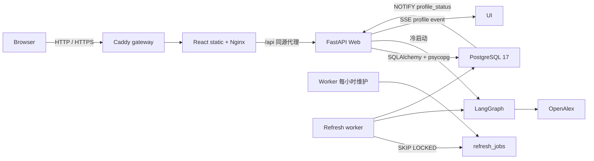

# 技术架构说明

## 总体结构

| 层 | 技术 | 责任 |
|----|------|------|
| 前端 | Vite + React + TypeScript | 搜索、画像、登录、历史/收藏、SSE 与论文分页 |
| API | FastAPI | 密码登录、Cookie 会话、受保护查询、NDJSON 与 SSE |
| 工作流 | LangGraph | OpenAlex 获取、分析、图谱和载荷格式化 |
| Repository | SQLAlchemy 2 + psycopg | 事务化事实数据、画像、用户、状态和队列 |
| 数据库 | 标准 PostgreSQL 17 | 数据、约束、索引、通知和并发队列 |
| Worker | 独立 Python 进程 | 定时入队、刷新、质量检查、重试和清理 |
| 公网入口 | Caddy + Nginx | 自动 HTTPS、静态资源、同源 API 代理和日志 |

## 数据模型

| 表 | 作用与关键约束 |
|----|----------------|
| `scholars` | 学者实体；`unique(source, source_author_id)`，不按姓名合并 |
| `scholar_aliases` | 中文、拼音和英文署名 |
| `institutions` | 机构实体；`unique(source, source_institution_id)` |
| `scholar_institutions` | 学者—机构多对多 |
| `works` | 全部论文；`unique(source, source_work_id)` |
| `authorships` | 论文—作者事实、顺序和原始署名 |
| `scholar_profiles` | 每位学者一份最新成功 JSONB、warnings、工作流版本和数据指纹 |
| `profile_status` | 轻量状态、版本和更新时间 |
| `refresh_jobs` | 任务状态、次数、退避、原因和错误 |
| `app_users` | 应用用户；规范化用户名唯一、scrypt 密码摘要和启停状态 |
| `auth_login_attempts` | 登录结果、用户名、IP 和时间，用于短时限速与审计 |
| `auth_registration_attempts` | 注册结果、IP 和时间，用于公开注册防滥用 |
| `user_sessions` | 不透明会话 token 摘要、过期和撤销时间 |
| `user_history` | 用户私有访问历史，同一用户/学者合并次数 |
| `favorites` | 用户私有收藏，复合主键去重 |

`backend/migrations/*.py` 是唯一结构来源。Alembic 使用数据库所有者账号，运行时使用固定受限角色 `scholar_app`。数据库仅位于服务端私网，不向浏览器开放；所有用户所有权检查由 FastAPI 完成。

## 画像读写流程

### 交互式查询

1. `POST /api/profile/stream` 每次都运行 LangGraph，通过 NDJSON 输出进度，不以已有画像短路查询。
2. OpenAlex 作者详情和论文游标分页必须完整结束。
3. 质量检查比较 `works_count`、本次数量和上一成功数量。
4. 同一事务写入学者、机构、论文、authorship、最新画像和数据指纹。
5. `profile_status.version + 1` 并设为 `ready`；触发器发送轻量 PostgreSQL 通知。

### 最近成功画像与后台更新

- PostgreSQL 只保留每位学者最近一次通过质量检查的画像，供质量对比、论文分页和自动换版使用。
- `POST /api/profile` 读取最近成功画像；前端交互式搜索统一使用 `/api/profile/stream` 获取当前数据。
- 收藏学者使用 24 小时阈值；最近 30 天访问者使用 7 天阈值。
- 后台维护按阈值原子去重插入 `refresh_jobs`，不改变用户主动查询始终重新获取的行为。
- 只有完整抓取成功才允许删除已消失的中心作者 authorship。

### Worker

Worker 使用 `FOR UPDATE SKIP LOCKED` 原子领取任务，支持多实例并发。失败按指数退避，最多 3 次；未通过质量门槛不会进入发布事务。每小时维护使用 PostgreSQL advisory lock，避免多 worker 重复调度，并清理过期登录尝试、session 和 30 天前任务日志。维护任务还会回收锁定超过 30 分钟的失联 worker 任务：未满 3 次则重新排队，否则标记失败，同时同步画像状态。

## 身份认证

1. `POST /api/auth/register` 校验用户名和密码，按来源 IP 限制每小时 10 次尝试，保存随机盐 scrypt 摘要。
2. 注册成功后自动创建会话；用户名冲突返回 409，不覆盖已有账号。
3. `POST /api/auth/login` 先按规范化用户名和请求 IP 检查 15 分钟失败次数，再以恒定路径校验密码。
4. 成功后生成高熵随机会话 token；浏览器收到 `HttpOnly`、`SameSite=Lax` Cookie，数据库只保存 SHA-256 摘要。
5. `require_user` 从会话摘要解析启用用户；搜索、画像、论文、SSE、历史和收藏接口全部依赖该检查。
6. 历史和收藏 Repository 查询同时限制 `user_id`，确保多用户数据隔离。
7. 退出时服务端撤销会话并清除 Cookie；管理员重置密码时撤销该用户已有会话。

系统提供公开本地账号注册，但不依赖外部身份提供商。建议前后端同域部署，以简化 Cookie 和 CSRF 边界；生产环境必须启用 HTTPS 与 Secure Cookie。

## 实时更新

`profile_status` 的 INSERT/UPDATE 触发 `pg_notify('profile_status', ...)`。FastAPI 内部持有一个共享 `LISTEN` 连接，把事件分发到订阅该学者的 SSE 客户端。前端仅在 `status=ready` 且新版本大于当前版本时重新请求画像；大型 JSONB 不进入通知载荷。

SSE 连接断开不会影响画像生成，浏览器重连后会先读取当前 `profile_status`，避免遗漏版本变化。

## 安全与权限

- PostgreSQL 不对公网开放；API 是唯一浏览器数据入口。
- 迁移撤销 `PUBLIC` 对 schema、表和 sequence 的默认权限。
- `scholar_app` 只用于 Web/worker，不能建表；迁移账号不提供给运行时。
- 密码与会话 token 均不明文入库；注册按 IP 限速，登录按用户名和 IP 限速，会话具有过期和撤销状态。
- CORS 仅允许配置的前端域名，Cookie 请求启用 credentials。
- 数据库和 LLM 密钥全部为服务端配置，不进入 Vite bundle。

## 部署模型

仓库提供两种兼容部署方式：

1. **单机 Compose（当前交付）**：Caddy、Nginx 前端、Web、worker、迁移和 PostgreSQL 运行在一台 ECS。公网只暴露 Caddy 的 80/443，数据库端口仅绑定回环地址。`deploy/bootstrap-aliyun.sh` 可为 Ubuntu 24.04 ECS 安装 Docker、配置可选 ACR 加速、补充 Swap、生成首次配置与定时备份；`deploy/deploy.sh` 负责后续每次发布的配置校验、构建、迁移和健康等待。用户在 Web 登录弹窗中自助注册。
2. **ECS + RDS（容量增长后）**：Caddy/Nginx、Web、worker 部署在 ECS，PostgreSQL 使用同 VPC 的 RDS。部署流水线先以迁移账号执行 Alembic，再启动受限账号的运行时服务。

无论采用哪种方式，公网只暴露 80/443；生产必须使用 HTTPS、安全 Cookie、独立备份和恢复演练。
