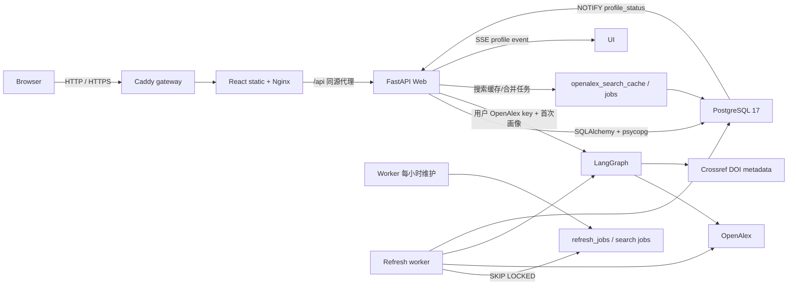

# 技术架构说明

## 总体结构

| 层 | 技术 | 责任 |
|----|------|------|
| 前端 | Vite + React + TypeScript | 身份确认、线性画像、证据化对比、近期变化、登录、历史/研究追踪、SSE 与论文分页 |
| API | FastAPI | 密码登录、Cookie 会话、受保护查询、NDJSON 与 SSE |
| 工作流 | LangGraph | OpenAlex 发现、Crossref 核验、数据裁决、并行分析、证据审查和载荷格式化 |
| Repository | SQLAlchemy 2 + psycopg | 事务化事实数据、画像、加密用户凭据、持久搜索缓存、按用户额度状态和队列 |
| 数据库 | 标准 PostgreSQL 17 | 数据、约束、索引、通知和并发队列 |
| Worker | 独立 Python 进程 | 定时入队、刷新、质量检查、重试和清理 |
| 公网入口 | Caddy + Nginx | 自动 HTTPS、静态资源、同源 API 代理和日志 |

前端将文章详情、查询历史和研究追踪作为同一类响应式侧栏：`lg` 及以上进入页面网格的独立列，主内容同步收缩；较窄视口改为带遮罩的抽屉，手机宽度占满屏幕。面板使用动态视口高度和内部滚动，长标题、机构名和论文信息允许换行，避免水平溢出。

画像主内容不再按标签页割裂，严格按产品顺序线性渲染：学者简介、当前主要研究方向、研究方向时间线、近期变化、核心指标、代表论文、全部论文、合作网络、数据核验与局限。切换学者时，前端通过 `AbortController` 和请求序号共同取消并忽略旧搜索/画像结果。

时间线方向标签把 `{year, topic}` 传给全部论文组件并滚动到论文区；`GET /api/authors/{author_id}/works` 使用可选 `year`、`topic` 参数在 PostgreSQL 中筛选。新发布画像将工作流 `topic_clusters.paper_indices` 写入每篇论文 `raw_json.analysis_topics`，确保方向与论文精确关联；旧画像兼容使用 OpenAlex topic、keyword、concept 和标题短语匹配。筛选仍使用原有游标分页、登录校验、错误重试和请求取消机制。

学者对比由前端编排现有搜索与流式画像接口：当前画像作为基准，用户搜索并确认第二个 OpenAlex 实体后调用 `POST /api/profile/stream` 获取当次数据。比较指标完全从两份同结构画像派生，不新增独立缓存或统计口径；研究方向、时间线、代表作、论文与引用、影响力、合作者和近期变化模块逐项显示事实或计算口径。桌面端并排展示，窄屏端纵向排列并在弹层内部滚动。

近期研究变化复用工作流 `analyze_evolution` 生成的 `interestTimeline` 和引用统计节点生成的 `yearlyTrend`。前端以最近有论文的年份作为结束点，构造连续两个三年窗口；论文数量按年度事实汇总，方向升降按各窗口主题关联次数占比计算，降低总发文量变化造成的误判。六年矩阵在手机端使用紧凑固定列，不产生页面级横向滚动。

候选搜索先为同名 OpenAlex 作者抽取最多 100 篇高被引论文的轻量身份指纹。身份裁决采用保守规则：ORCID 相同直接归并；不同 ORCID 默认隔离，不能再由共同机构或主题数量覆盖；缺少 ORCID 时仍需共同论文，或机构、合作者、主题的比例型组合证据。机构履历异常扩散的档案不参与上下文自动归并，避免污染档案在常见姓名中形成连锁误合并。聚类以高引用档案作为主 ID，不通过阈值的同名者保持独立。前端只提交聚类得到的 ID 集合，工作流会再次计算指纹并拒绝不属于主身份组的 ID，避免客户端强制合并任意学者。

搜索先规范化 Unicode、空白和大小写得到共享 `query_key`。每位登录用户必须先配置自己的 OpenAlex key；Web 解密后只在当前调用内传给客户端函数，不写入缓存或工作流结果。新鲜 `openalex_search_cache` 直接返回；过期结果先返回旧值并把 `requested_by_user_id` 写入后台刷新，冷请求以 `openalex_search_jobs` 的活跃任务唯一索引合并，多 Web 实例只有一个请求或 worker 访问上游。OpenAlex 不可用、限流或该用户剩余额度到达保留线时，Repository 可按学者名/别名从已发布的真实 PostgreSQL 学者数据构造保守候选；没有本地事实时才返回明确上游错误。`openalex_identity_cache` 让不同姓名查询复用昂贵的论文/合作者/主题指纹，但不改变既有归并阈值。

多来源工作流先保留 `source_works` 原始记录：OpenAlex 负责作者、论文、引用、topics、keywords 和署名发现，Crossref 只对 OpenAlex 论文中的 DOI 进行出版元数据核验。被验证为同一身份的多个作者档案并发取数，中心 authorship 统一为主 ID。随后建立机构、合作者和主题频率核心，只排除同时具有明确冲突机构、且与核心合作者/主题均断开的微小论文连通簇；无机构论文和较大冲突簇不会自动删除。过滤结果、排除 Work ID 和风险数量写入 `identityAudit`，再按 DOI/OpenAlex Work ID 去重。`adjudicate_sources` 以规范化 DOI 合并记录，Crossref 优先提供标题、年份和期刊，OpenAlex 继续提供引用、主题和 authorships；所有字段来源、原始记录、核验状态和冲突写入论文 `raw_json`。

研究方向节点聚合 OpenAlex 四级 topics、与标题匹配或跨论文重复的 keywords，以及论文标题中的高频 2–4 元短语。明确的宽泛学科词被过滤，中层领域词降权；细粒度主题按数据支持度、近年论文和有限引用权重排序，并保留关联论文索引供近期变化、代表作和证据审查复算。`review_evidence` 在载荷格式化前检查指标可复算性和论文链接可追溯性，输出结构化审查结果并参与发布门禁。

## 数据模型

| 表 | 作用与关键约束 |
|----|----------------|
| `scholars` | 学者实体；`unique(source, source_author_id)`，不按姓名合并 |
| `scholar_aliases` | 中文、拼音和英文署名 |
| `institutions` | 机构实体；`unique(source, source_institution_id)` |
| `scholar_institutions` | 学者—机构多对多 |
| `works` | 全部论文；`unique(source, source_work_id)` |
| `authorships` | 论文—作者事实、顺序和原始署名 |
| `scholar_profiles` | 每位学者一份最新成功 JSONB、warnings、工作流版本和数据指纹 |
| `profile_status` | 轻量状态、版本和更新时间 |
| `refresh_jobs` | 任务状态、次数、退避、原因、错误和请求用户 |
| `openalex_search_cache` | 规范化姓名的候选 JSONB、抓取时间和过期时间 |
| `openalex_identity_cache` | OpenAlex 作者身份指纹，按作者 ID 去重并独立设置 TTL |
| `openalex_search_jobs` | 冷搜索/过期搜索刷新队列；保存请求用户，同一 `query_key` 只允许一个活跃任务 |
| `upstream_rate_limits` | 按 `openalex:user:{user_id}` 隔离的额度、恢复时间和最近响应状态 |
| `app_users` | 应用用户；规范化用户名唯一、scrypt 密码摘要和启停状态 |
| `user_api_credentials` | 用户上游凭据；Fernet 密文、末四位提示和验证时间，复合主键隔离用户/provider |
| `auth_login_attempts` | 登录结果、用户名、IP 和时间，用于短时限速与审计 |
| `auth_registration_attempts` | 注册结果、IP 和时间，用于公开注册防滥用 |
| `api_rate_limit_events` | 搜索与画像生成的账号、IP、动作和时间窗口计数 |
| `user_sessions` | 不透明会话 token 摘要、过期和撤销时间 |
| `user_history` | 用户私有访问历史，同一用户/学者合并次数 |
| `favorites` | 用户私有研究追踪；复合主键去重，并保存上次查看的画像版本、论文数和引用数基线 |

`backend/migrations/*.py` 是唯一结构来源。Alembic 使用数据库所有者账号，运行时使用固定受限角色 `scholar_app`。数据库仅位于服务端私网，不向浏览器开放；所有用户所有权检查由 FastAPI 完成。

## 画像读写流程

### 交互式查询

1. `POST /api/profile/stream` 先读取最近成功画像：已有画像立即以 NDJSON `result` 返回，超过阈值时只幂等排队；仅首次画像同步运行 LangGraph 并输出四阶段进度。
2. 对候选身份组再次验证；仅联合获取通过身份阈值的 OpenAlex 作者详情和论文，游标分页必须完整结束。
3. 对有 DOI 的论文查询 Crossref，并记录已核验、未找到、失败和核验上限。
4. 数据裁决节点按 DOI 合并来源，保留字段来源与冲突，产出统一论文集和 `dataAudit`。
5. 引用、细粒度方向、演化和合作节点并行消费统一论文集；总结生成后执行证据审查。
6. 质量检查比较 `works_count`、本次数量、上一成功数量和证据审查结果。
7. 同一事务写入学者、机构、论文、authorship、最新画像和数据指纹。
8. `profile_status.version + 1` 并设为 `ready`；触发器发送轻量 PostgreSQL 通知。

### 最近成功画像与后台更新

- PostgreSQL 只保留每位学者最近一次通过质量检查的画像，供质量对比、论文分页和自动换版使用。
- `POST /api/profile` 读取最近成功画像；前端候选确认统一使用 `/api/profile/stream`，已有画像走缓存结果、首次画像走工作流。
- 研究追踪学者使用 24 小时阈值；最近 30 天访问者使用 7 天阈值。
- 后台维护和用户打开过期画像都按阈值原子去重插入 `refresh_jobs`，同时保存具有有效 key 的请求用户；用户立即看到最近成功画像，不在 Web 请求内等待更新。
- 只有完整抓取成功才允许删除已消失的中心作者 authorship。
- 追踪列表把最新画像中的论文数、引用数与当前用户的 `favorites` 基线比较，并从当前画像的两个三年窗口确定性识别方向变化提示。用户加载到相应画像版本后调用 `/api/tracking/seen`，事务内更新自己的基线，不影响其他用户。
- `POST /api/tracking/{author_id}/refresh` 先通过会话确定用户，再验证该用户确实存在对应 `favorites` 记录和 OpenAlex key；随后调用现有 `enqueue_refresh` 并写入 `requested_by_user_id`。数据库活跃任务唯一索引与 Repository 的 `on conflict do nothing` 共同防止重复排队，返回已有或新任务 ID。Web 请求不调用 LangGraph，worker 继续通过 `FOR UPDATE SKIP LOCKED` 领取任务。
- 新前端统一使用 `/api/tracking...`；旧 `/api/favorites...` 仅作为兼容别名保留，数据库表名和历史 migration 不改写。主画像和追踪侧栏在写操作成功后递增本地修订号并重新读取追踪 API，避免同一页面的两个入口显示相互矛盾的状态。

### Worker

Worker 先使用 `FOR UPDATE SKIP LOCKED` 领取 `openalex_search_jobs`，再领取 `refresh_jobs`，按 `requested_by_user_id` 读取并解密该用户的 key；不存在、已删除或不可解密时任务失败，绝不回退到共享 key。搜索成功发布共享缓存，失败按上游 `Retry-After` 或指数退避重排；画像失败最多重试 3 次，未通过质量门槛不会进入发布事务。每小时维护只为具有有效 OpenAlex key 的追踪/近期访问用户排队，并使用 PostgreSQL advisory lock 避免多 worker 重复调度。

## 身份认证

1. `POST /api/auth/register` 校验用户名和密码，按来源 IP 限制每小时 10 次尝试，保存随机盐 scrypt 摘要。
2. 注册成功后自动创建会话；用户名冲突返回 409，不覆盖已有账号。
3. `POST /api/auth/login` 先按规范化用户名和请求 IP 检查 15 分钟失败次数，再以恒定路径校验密码。
4. 成功后生成高熵随机会话 token；浏览器收到 `HttpOnly`、`SameSite=Lax` Cookie，数据库只保存 SHA-256 摘要。
5. `require_user` 从会话摘要解析启用用户；搜索、画像、论文、SSE、历史和研究追踪接口全部依赖该检查。
6. 历史和研究追踪 Repository 查询同时限制 `user_id`，确保多用户数据隔离。
7. 退出时服务端撤销会话并清除 Cookie；管理员重置密码时撤销该用户已有会话。
8. 搜索和画像生成在 PostgreSQL 事务内按用户与 IP 消费额度，多 Web 实例共享同一限制。
9. `GET/PUT/DELETE /api/settings/openalex` 只操作当前会话用户；PUT 先调用 OpenAlex `/rate-limit` 校验，再用服务器 `CREDENTIAL_ENCRYPTION_KEY` 加密。GET 只返回配置状态、末四位和时间。

系统提供公开本地账号注册，但不依赖外部身份提供商。建议前后端同域部署，以简化 Cookie 和 CSRF 边界；生产环境必须启用 HTTPS 与 Secure Cookie。

## 进度与错误边界

- NDJSON 仍由既有 LangGraph 节点驱动，但 API 只向前端暴露四个稳定阶段：`verify_identity`、`aggregate_outputs`、`analyze_trajectory`、`verify_evidence`。
- 搜索使用 30 秒总超时；同一冷查询最多等待共享任务 25 秒，超时返回可重试 503。画像流在 120 秒没有收到任何数据时判定为空闲超时。网络、超时、429、401、428（缺少用户 key）和工作流/worker 失败分别映射为独立前端状态。OpenAlex 客户端显式接收当前用户 key，在重试耗尽后保留上游状态码和 `Retry-After`，但不会把 key 写入异常；每次上游响应把该用户额度写入 PostgreSQL，达到保留线后阻止该用户的新冷请求。
- 外部数据错误仍通过流式 `error` 事件结束；搜索与流式画像共享当前请求序号，全部论文分页及 SSE 触发的最新版读取也使用 `AbortController`，前端不会把中断或旧请求结果覆盖到新选择的学者。
- 追踪/历史和全部论文面板分别提供 loading、empty、error 与 retry 状态；错误态不会同时渲染为空态。

## 实时更新

`profile_status` 的 INSERT/UPDATE 触发 `pg_notify('profile_status', ...)`。FastAPI 内部持有一个共享 `LISTEN` 连接，把事件分发到订阅该学者的 SSE 客户端。前端仅在 `status=ready` 且新版本大于当前版本时重新请求画像；大型 JSONB 不进入通知载荷。

SSE 连接断开不会影响画像生成，浏览器重连后会先读取当前 `profile_status`，避免遗漏版本变化。

## 安全与权限

- PostgreSQL 不对公网开放；API 是唯一浏览器数据入口。
- 迁移撤销 `PUBLIC` 对 schema、表和 sequence 的默认权限。
- `scholar_app` 只用于 Web/worker，不能建表；迁移账号不提供给运行时。
- 密码与会话 token 均不明文入库；注册按 IP 限速，登录按用户名和 IP 限速，会话具有过期和撤销状态。
- OpenAlex key 使用 Fernet 对称加密；生产部署强制提供独立的 44 字符 `CREDENTIAL_ENCRYPTION_KEY`，Web/worker 共用且不可随意轮换。完整用户 key 不进入前端持久存储、API 读取响应、日志或异常。
- 生产环境的凭据写接口拒绝公网 HTTP 并返回 426；仅开发环境和回环主机允许 HTTP 测试。正式用户提交 key 前必须启用 HTTPS。
- 搜索与画像生成设置独立账号/IP 限额，事件由 worker 定期清理。
- CORS 仅允许配置的前端域名，Cookie 请求启用 credentials。
- 数据库、凭据加密 key 和 LLM 密钥全部为服务端配置，不进入 Vite bundle；OpenAlex key 由各用户提交并按账号加密隔离。

## 部署模型

仓库提供两种兼容部署方式：

1. **单机 Compose（当前交付）**：Caddy、Nginx 前端、Web、worker、迁移、自动备份和 PostgreSQL 运行在一台 ECS。公网只暴露 Caddy 的 80/443，数据库端口仅绑定回环地址。`deploy/bootstrap-aliyun.sh` 可为 Ubuntu 24.04 ECS 安装 Docker、配置可选 ACR 加速、补充 Swap 和生成首次配置；`deploy/deploy.sh` 负责后续每次发布的配置校验、构建、迁移和健康等待。用户在 Web 登录弹窗中自助注册。
2. **ECS + RDS（容量增长后）**：Caddy/Nginx、Web、worker 部署在 ECS，PostgreSQL 使用同 VPC 的 RDS。部署流水线先以迁移账号执行 Alembic，再启动受限账号的运行时服务。

无论采用哪种方式，公网只暴露 80/443；生产必须使用 HTTPS、安全 Cookie、独立备份和恢复演练。
