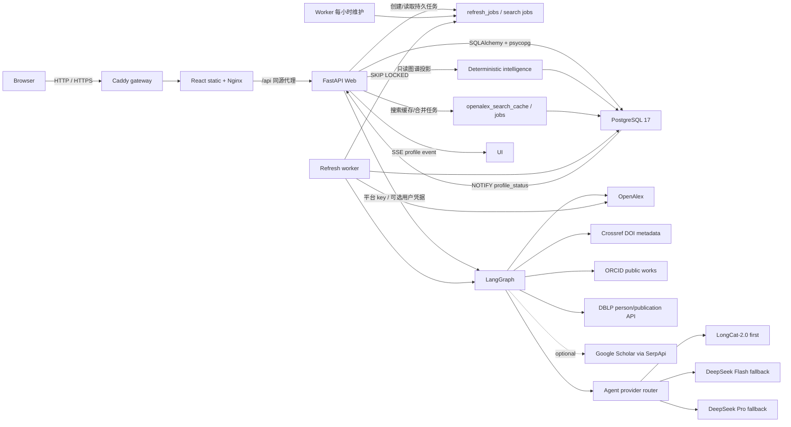

# 技术架构说明

## 总体结构

| 层 | 技术 | 责任 |
|----|------|------|
| 前端 | Vite + React + TypeScript | 身份确认、五栏画像、证据化分析/比较、近期变化、登录、历史/研究追踪、SSE 与论文分页 |
| API | FastAPI | 密码登录、Cookie 会话、受保护查询、确定性智能投影、NDJSON 与 SSE |
| 工作流 | LangGraph | OpenAlex 发现、Crossref/ORCID/DBLP 核验、可选 Google Scholar、数据裁决、模型回退、多个学术分析 Agent、确定性证据审查和载荷格式化 |
| Repository | SQLAlchemy 2 + psycopg | 事务化事实数据、画像、加密用户凭据、持久搜索缓存、按用户额度状态和队列 |
| 数据库 | 标准 PostgreSQL 17 | 数据、约束、索引、通知和并发队列 |
| Worker | 独立 Python 进程 | 定时入队、刷新、质量检查、重试和清理 |
| 公网入口 | Caddy + Nginx | 自动 HTTPS、静态资源、同源 API 代理、Docker DNS 动态解析和日志 |

匿名前端先展示 Hero 搜索、原创科研插画、三项核心能力和数据可信说明，不自动打开登录框。`LandingGuide` 在其后用浏览器原生组件提供三步指南和六段匿名案例，覆盖候选确认、后台工作流、画像概览、合作网络节点/连线、查询历史、研究追踪和能力边界；不依赖截图缩放，因此在高分屏与移动端保持清晰。`LandingHero` 使用 `IntersectionObserver` 切换内容显隐类，并通过 `prefers-reduced-motion` 关闭动态效果。匿名搜索把姓名保存在 `App` 状态并打开可关闭的认证弹窗；注册或登录成功后继续原搜索，后端查询路由没有开放匿名权限。

全局视觉变量集中在 `src/index.css`，暖黑/米白主题共同使用低饱和青绿语义色；`Button`、`Card`、`Tabs` 等基础组件负责圆角、边框、焦点和阴影一致性，业务组件不保存独立主题状态。首屏的明暗两套插画均以压缩 JPEG 随前端构建发布，不从第三方站点热链；React 只根据全局主题切换可见图层，CSS 负责淡入、轨道和浮动动画，并通过 `prefers-reduced-motion` 关闭非必要动态效果。`I18nProvider` 同步维护根元素 `lang`，CSS 据此选择中文与英文的字体和响应式排版。管理员看板作为应用一级内容视图渲染，不再以覆盖业务页面的固定定位层实现。

前端将文章详情、查询历史和研究追踪作为同一类响应式面板：`1280px` 及以上进入页面网格的独立列，主内容同步收缩；主页面宽度使用父网格列的百分比而不是 `100vw`，确保侧栏出现后不会继续按完整视口扩张。较窄视口改为从固定导航下方展开的完整焦点面板和遮罩，内部内容保持可滚动。面板使用动态视口高度，长标题、机构名和论文信息允许换行，避免遮挡、裁切或水平溢出。

认证后的导航最右侧渲染 `UserMenu` 圆形头像。账户入口和设置共用头像下方的锚定 popover，不再创建遮罩层或全屏 dialog；设置内部按外观与安全切换，并以动态视口高度限制和内部滚动适配小屏。用户偏好由 `app_users.display_name/avatar_key/theme` 保存；选择主题时先在根元素即时替换主题 class，关闭未保存设置则恢复当前用户主题，`PATCH /api/account/profile` 成功后再持久化。主题变量同时驱动基础组件、图表与合作网络。`POST /api/account/password` 在校验当前密码后轮换密码与会话，退出登录也从头像菜单触发。

画像主内容按“学者概览 / 学术成果 / 合作关系 / 研究脉络 / 同行与机构”五栏组织。概览先展示研究画像，再把研究方向与核心指标合并呈现，随后展示近期变化、时间线和折叠的数据说明；学术成果使用确定性代表作结果并保留全部论文；合作关系包含核心合作者和关系图；研究脉络包含阶段、方向变化、方向活跃度和摘要演进；同行与机构只展示分析进度、用途导向的相关学者和真实相关机构，不再重复渲染底部通用计算说明。时间线方向点击会切换到学术成果并应用对应筛选。

候选选择页不渲染后端身份聚类的内部术语、分组分数、档案指纹或重复证据框，只使用机构、ORCID、研究方向、论文、引用、h-index 和最近发表年份帮助用户选择。主卡片通过作者 `affiliations` 年份和身份指纹中的目标作者论文署名统计，只选择一个满足连续两年或至少两篇论文支持的主要机构；其余机构保留为默认收起的往年关联信息，并继续参与机构筛选。后台仍保留完整 `identity_evidence`、`match_reasons` 与身份分组用于排序、审计和工作流校验。

`DataVerification` 不再渲染 Agent 名称、模型或降级状态；主层只显示收录论文、更新时间、数据来源和可能遗漏，Crossref 覆盖、来源差异和已知局限置于折叠说明。模型运行信息继续保存在 `agentAnalysis` 中供服务端审计，不作为学术结论展示。

`affiliation_evidence.py` 把 OpenAlex 作者 `affiliations` 和目标 author ID 的论文 `raw_affiliation_strings` 保留为内部身份核验证据。`select_primary_affiliation` 依次按最近六年覆盖年份数、最近关联年份、全职业覆盖年份数排序。该模块不解析或生成任职、院系、实验室、职称、学位或培养阶段；概览只展示独立来源核验的任职/教育、公共标识和分析依据，不再重复渲染 OpenAlex 机构历史与论文署名原文。底层 JSON 继续供身份裁决和审计使用。

合作摘要保留 coauthor OpenAlex ID；网络上方姓名按钮和图节点只打开合作者详情侧栏，侧栏中的“查询画像”按钮才调用画像加载函数，避免浏览图谱时意外切换当前学者。`CollaborationGraph` 从 CSS 语义变量读取中心、一般、稳定、紧密和峰值合作色，主题类变化时重新生成 vis-network 配色；`ResizeObserver` 在详情面板开合或容器变化后重绘并 fit，避免节点被裁切。图谱提供悬停指针、恢复完整视图和全屏操作。主学者姓名打开 OpenAlex，合作边打开共同论文侧栏。画像主体由 `ProfileSection` 和 `ScholarIntroduction` 负责，语言组装、身份事实与页面编排分离。

时间线方向标签把 `{year, topic}` 传给论文栏；React 在栏内容挂载后再滚动，避免切换时引用尚不存在。`GET /api/authors/{author_id}/works` 使用可选 `year`、`topic` 参数精确筛选 `raw_json.analysis_topics`。研究图谱 upsert 以 JSONB 合并更新 `raw_json`，不得覆盖画像分析主题、来源裁决和核验元数据。代码内 `analysisVersion=2` 让旧画像在访问时返回可用内容并幂等排队后台重算，不批量消耗外部额度；更新期间方向按钮禁用并显示说明。

学者对比由前端编排现有搜索与流式画像接口：当前画像作为基准，用户搜索并确认第二个 OpenAlex 实体后调用 `POST /api/profile/stream` 获取当次数据。比较指标完全从两份同结构画像派生，不新增独立缓存或统计口径；研究方向、时间线、代表作、论文与引用、影响力、合作者和近期变化模块逐项显示事实或计算口径。桌面端并排展示，窄屏端纵向排列并在弹层内部滚动。

近期研究变化复用工作流 `analyze_evolution` 生成的 `interestTimeline` 和引用统计节点生成的 `yearlyTrend`。前端以最近有论文的年份作为结束点，构造连续两个三年窗口；论文数量按年度事实汇总，方向升降按各窗口主题关联次数占比计算，降低总发文量变化造成的误判。六年矩阵在手机端使用紧凑固定列，不产生页面级横向滚动。

候选搜索先为同名 OpenAlex 作者抽取最多 100 篇高被引论文的轻量身份指纹。身份裁决采用保守规则：ORCID 相同直接归并；不同 ORCID 默认隔离，不能再由共同机构或主题数量覆盖；缺少 ORCID 时仍需共同论文，或机构、合作者、主题的比例型组合证据。机构履历异常扩散的档案不参与上下文自动归并，避免污染档案在常见姓名中形成连锁误合并。聚类以高引用档案作为主 ID，不通过阈值的同名者保持独立。前端只提交聚类得到的 ID 集合，工作流会再次计算指纹并拒绝不属于主身份组的 ID，避免客户端强制合并任意学者。

搜索先规范化 Unicode、空白和大小写得到共享 `query_key`。Web 与 worker 优先读取服务器 `OPENALEX_API_KEY`，普通用户无需配置数据源密钥；历史个人 key 仅在服务端 key 缺失时兼容回退。新鲜 `openalex_search_cache` 直接返回；过期结果先返回旧值并把 `requested_by_user_id` 写入后台刷新，冷请求以 `openalex_search_jobs` 的活跃任务唯一索引合并，多 Web 实例只有一个请求或 worker 访问上游。OpenAlex 不可用、限流或平台剩余额度到达保留线时，Repository 可按学者名/别名从已发布的真实 PostgreSQL 学者数据构造保守候选；没有本地事实时才返回明确上游错误。`openalex_identity_cache` 让不同姓名查询复用昂贵的论文、合作者、主题和目标作者机构支持统计；指纹与候选载荷都有独立版本，旧缓存会自动补算，不改变既有归并阈值。

多来源工作流先保留 `source_works` 原始记录：OpenAlex 负责发现，Crossref 按 DOI 核验出版元数据，`orcid.py` 读取公共 ORCID works，`dblp.py` 先按姓名、机构或 ORCID 选择 DBLP person，再只匹配当前已有论文。`google_scholar.py` 是可选 SerpApi 适配器；无 key 时返回 `disabled` 且不发网络请求，有 key 时同样只按题名年份核对已有论文。来源裁决后，`resolve_work_identity` 以 ORCID 命中和 Crossref 作者 ORCID为强锚点；论文簇只由 DOI、同题同年记录或稳定合作者建立强连接，机构用于主簇评分但不能单独产生传递连接，主题相似只用于分析。

研究方向优先聚合 OpenAlex topics 与重复 keywords；标题 2–4 元短语必须至少出现在 3 篇论文中才可辅助候选。`topic_agent` 输出 2–8 词规范方向名，标题复制、高相似标题、宽泛标签或不可追溯结果均被 Pydantic 后置校验拒绝。`trajectory_agent` 消费两个三年窗口的方向数量/占比、双语方向说明和代表论文 ID/标题/年份，最多输出四条内容级洞察；未知方向、虚构论文、纯数字复述和无证据推断不能发布。前端只渲染服务端用真实论文对象回填的 `evidencePapers`。

模型输出不是事实来源。`review_evidence` 仍在载荷格式化前确定性检查指标可复算性、论文链接可追溯性和证据 ID；Agent 审查只能降低置信度或触发模板重建，不能批准确定性门禁拒绝的内容。`agentAnalysis` 只保存 Agent 名称、提供商、模型、层级、回退原因、状态、趋势结论和审查摘要，不保存 key、完整提示词或原始响应。配置 `LONGCAT_API_KEY` 后，每个 Agent 先调用 `LongCat-2.0`（关闭 thinking 以稳定返回结构化正文）；网络、额度、JSON 或输出校验失败后，才进入现有 `LLM_*` DeepSeek Flash/Pro 路径。`LLM_STRONG_DAILY_LIMIT` 仅限制 DeepSeek Pro 调用。

`backend/trace_workflow.py` 可在生产同等环境中直接执行 LangGraph，并将每个节点的脱敏输入摘要、增量输出、模型提供商、状态和耗时写入 JSON。论文只保留数量与最多两个公开样本；凭据、Token、完整提示词和模型原始响应不会进入报告。该工具用于区分数据源、身份裁决、模型调用、并行 Worker 和审查循环的实际耗时，不作为用户画像接口，也不写入业务数据库。

## 数据模型

| 表 | 作用与关键约束 |
|----|----------------|
| `scholars` | 学者实体；`unique(source, source_author_id)`，不按姓名合并 |
| `scholar_aliases` | 中文、拼音和英文署名 |
| `institutions` | 机构实体；`unique(source, source_institution_id)` |
| `scholar_institutions` | 学者—机构多对多 |
| `works` | 全部论文；`unique(source, source_work_id)` |
| `work_external_ids` | DOI/OpenAlex/Crossref 稳定标识到规范论文的唯一映射 |
| `authorships` | 论文—作者事实、顺序和原始署名 |
| `research_topics`、`work_topics`、`scholar_topics` | 主题实体、论文—主题和学者—主题时间统计；关系唯一且记录来源/置信度 |
| `collaborations`、`collaboration_works` | 规范化作者对及共同论文；作者 UUID 排序保证同一合作只存一次 |
| `work_citations` | 引用边；未在本地图谱出现的被引论文保留 OpenAlex ID，后续增量可回连 |
| `paper_insights` | 仅基于摘要的抽取式问题、方法、贡献、方向关系和原句证据 |
| `timeline_events` | 论文、主题、合作和机构事件；`unique(scholar_id, event_key)` |
| `research_graph_sync_state` | 最近尝试/成功、水位、指纹、版本、warning 和错误 |
| `research_graph_refresh_jobs` | 单学者增量/重建任务；每个学者只允许一个活跃任务 |
| `field_discovery_state` | 目标学者的领域候选覆盖、批次进度、最近成功结果、错误与 7 天刷新水位 |
| `field_discovery_candidates` | 目标学者—领域候选关系；候选外键指向既有 `scholars`，分组计数只用于发现顺序 |
| `field_discovery_institutions` | 目标学者—真实机构关系及历史/近四年主题论文窗口统计 |
| `field_discovery_jobs` | 用户归属的领域发现任务；每个目标学者只允许一个活跃任务 |
| `scholar_intelligence_feedback` | 用户对指定分析结论的“有帮助/不准确”反馈；不保存或改写学术事实 |
| `scholar_profiles` | 每位学者一份最新成功 JSONB、warnings、工作流版本和数据指纹 |
| `profile_status` | 轻量状态、版本和更新时间 |
| `refresh_jobs` | 画像任务状态、次数、退避、原因、错误、请求用户、首次查询姓名和联合作者 ID |
| `openalex_search_cache` | 规范化姓名的候选 JSONB、抓取时间和过期时间 |
| `openalex_identity_cache` | OpenAlex 作者身份指纹，按作者 ID 去重并独立设置 TTL |
| `openalex_search_jobs` | 冷搜索/过期搜索刷新队列；保存请求用户，同一 `query_key` 只允许一个活跃任务 |
| `upstream_rate_limits` | `openalex:server` 平台额度及兼容个人 provider 的恢复时间和最近响应状态 |
| `app_users` | 应用用户；规范化用户名唯一、scrypt 密码摘要、昵称、预设头像、主题偏好、启停状态和角色 |
| `analytics_visitors` | 随机访客令牌的 SHA-256 摘要、可选用户和最近活动时间；不保存原始 IP |
| `analytics_events` | 页面访问、搜索、画像查看和异常分类；只保留必要动作、用户/学者引用与非敏感元数据 |
| `user_api_credentials` | 用户上游凭据；Fernet 密文、末四位提示和验证时间，复合主键隔离用户/provider |
| `auth_login_attempts` | 登录结果、用户名、IP 和时间，用于短时限速与审计 |
| `auth_registration_attempts` | 注册结果、IP 和时间，用于公开注册防滥用 |
| `api_rate_limit_events` | 搜索与画像生成的账号、IP、动作和时间窗口计数 |
| `user_sessions` | 不透明会话 token 摘要、过期和撤销时间 |
| `user_history` | 用户私有访问历史，同一用户/学者合并次数 |
| `favorites` | 用户私有研究追踪；复合主键去重，并保存上次查看的画像版本、论文数和引用数基线 |

`backend/migrations/*.py` 是唯一结构来源。Alembic 使用数据库所有者账号，运行时使用固定受限角色 `scholar_app`。数据库仅位于服务端私网，不向浏览器开放；所有用户所有权检查由 FastAPI 完成。

## 画像读写流程

### 交互式查询

1. 主画像调用 `POST /api/profile/jobs`。已有画像立即返回；首次画像在同一事务写入学者占位、用户历史和 `profile_status=queued`，再幂等创建保存查询姓名与联合作者 ID 的 `refresh_jobs`，Web 请求随即结束。
2. Worker 领取任务后对候选身份组再次验证；常规候选仅联合获取通过身份阈值的 OpenAlex 作者详情和论文。若候选来自没有 Author ID 的精确论文署名，则使用 `provisional:<work_id>:<authorship_index>` 作为稳定锚点，重新核对署名、机构、DOI 与合作者，并只保留与锚点通过重复论文或稳定合作者连接的保守论文簇。
3. 对有 DOI 的论文查询 Crossref；随后按作者身份选择 DBLP person 并匹配已有论文；配置 SerpApi 时再核对 Google Scholar。
4. 数据裁决节点按 DOI、题名和年份关联来源，保留字段来源与冲突；任何辅助来源都不能增加论文。身份节点再以 ORCID、机构和合作者裁定准确优先的主论文集。
5. 引用、细粒度方向、演化和合作节点只消费身份裁决后的论文集。合作图完成后，Orchestrator 根据代表作、合作者、机构和时间证据动态生成最多四个任务，通过 LangGraph `Send` 并行派发给专业 Worker，再汇总可追溯结论供总结 Agent 使用。
6. 总结生成后由 Evaluator 审查；拒绝时把 flags 与双语审查意见发送给 Optimizer 修改并再次审查，最多修订两轮。之后确定性证据门禁仍会逐项核对引用 ID、论文 URL/DOI 和统计口径。
7. 质量检查比较 `works_count`、本次数量、上一成功数量和证据审查结果。
8. 同一事务写入学者、机构、论文、authorship、最新画像和数据指纹。
9. `profile_status.version + 1` 并设为 `ready`；触发器发送 PostgreSQL 通知。前端也轮询带任务状态的查询历史，使用户离开生成页后仍能收到右下角完成提醒。
10. `POST /api/profile/stream` 保留为对比画像等兼容流程，不再作为主画像首次生成入口。

### 最近成功画像与后台更新

- PostgreSQL 只保留每位学者最近一次通过质量检查的画像，供质量对比、论文分页和自动换版使用。
- `POST /api/profile` 读取最近成功画像；前端候选确认使用 `/api/profile/jobs`，已有画像走缓存，首次画像只创建持久任务。
- `POST /api/authors/{author_id}/profile/refresh` 对任意已发布画像幂等插入 `manual_profile` 任务，完整重跑多来源和 Agent；同一学者只有一个活跃任务，当前成功画像继续可读。
- `profile_status` 的 queued/updating/failed 和版本发布均通过 LISTEN/NOTIFY 进入 SSE；同版本状态变化不再被过滤，前端只在更高版本 ready 后重新读取画像。
- 研究追踪学者使用 24 小时阈值；最近 30 天访问者使用 7 天阈值。
- 后台维护和用户打开过期画像都按阈值原子去重插入 `refresh_jobs`，同时保存请求用户用于审计；用户立即看到最近成功画像，不在 Web 请求内等待更新。
- 只有完整抓取成功才允许删除已消失的中心作者 authorship。
- 追踪列表把最新画像中的论文数、引用数与当前用户的 `favorites` 基线比较，并从当前画像的两个三年窗口确定性识别方向变化提示。用户加载到相应画像版本后调用 `/api/tracking/seen`，事务内更新自己的基线，不影响其他用户。
- `POST /api/tracking/{author_id}/refresh` 先通过会话确定用户，再验证该用户确实存在对应 `favorites` 记录和平台数据源配置；随后调用现有 `enqueue_refresh` 并写入 `requested_by_user_id`。数据库活跃任务唯一索引与 Repository 的 `on conflict do nothing` 共同防止重复排队，返回已有或新任务 ID。Web 请求不调用 LangGraph，worker 继续通过 `FOR UPDATE SKIP LOCKED` 领取任务。
- 新前端统一使用 `/api/tracking...`；旧 `/api/favorites...` 仅作为兼容别名保留，数据库表名和历史 migration 不改写。主画像和追踪侧栏在写操作成功后递增本地修订号并重新读取追踪 API，避免同一页面的两个入口显示相互矛盾的状态。

### 动态研究图谱

1. 用户打开“研究图谱”栏时，读取接口才检查图谱是否缺失、超过 7 天，或最近成功画像发布时间晚于图谱成功时间，并幂等插入 `research_graph_refresh_jobs`；普通画像访问不建图。人工刷新受既有画像额度限制，`force_rebuild` 只在上一轮失败后允许单学者全量读取。
2. worker 读取最近成功时间，普通更新使用向前重叠 30 天的 `from_publication_date`；该筛选和 `sort=publication_date` 可在 OpenAlex 免费计划运行，避免误用返回 `Plan upgrade required` 的 `from_updated_date`/`sort=updated_date`。首次和显式重建不带水位，但都只处理当前学者。
3. OpenAlex 作者与论文分页必须完整结束。任何页失败时不进入图谱内容事务；Crossref 失败只产生 warning，已经成功保存的 Crossref 标题、年份、期刊和类型不被 OpenAlex 回退值覆盖。
4. DOI 和 OpenAlex ID 先通过 `work_external_ids` 定位规范论文，再原子 upsert 署名、机构、主题、合作、引用、摘要理解和时间线。所有关系使用主键/唯一键去重。
5. `analysisVersion=2` 后，图谱只消费当前已发布画像的身份裁决后 Work ID；未进入主论文集的 OpenAlex 论文不会重新混入图谱。图谱更新合并 `works.raw_json`，保留论文栏的 `analysis_topics` 和来源核验元数据。
6. 摘要理解只抽取 OpenAlex 摘要原句；摘要缺失时 `based_on_abstract=false`，四个理解字段与证据数组为空。
7. 读取接口只有在 `last_success_at` 存在时才投影内容，论文查询必须连接 `paper_insights` 图谱标记，避免把普通画像论文冒充为首次失败图谱；后续失败仍返回最近成功内容。
8. 前端纯函数 view-model 按图谱批次中最多 1000 篇论文—主题关系计算最多五个研究阶段、相邻阶段方向迁移信号和主题强度矩阵；首屏先汇总论文数、年份范围、摘要证据、内部引用和画像身份风险，成功但无有效论文时给出明确空态。计算保持时间正序以保证“新进入/持续/退出”语义，展示层再统一按最新到最早排序。
9. 对象详情 API 只接受作者、论文、机构和主题 UUID，读取、刷新和对象详情全部经过登录依赖；刷新任务只使用服务器 key 或任务请求用户自己的加密凭据。

### 同行与机构及兼容智能分析

1. `field_discovery.py` 从目标学者的阶段 2 图谱选择最多三个长期主题和三个近四年主题，再通过 OpenAlex works grouping 分别发现作者与机构。分组结果只决定补全顺序，不进入最终推荐评分。
2. 每次成功发现最多保存 60 位候选关系；首批向既有 `research_graph_refresh_jobs` 排入 8 位，当前批次结束后每批再排 4 位，四类各有 3 个结果时可提前停止，累计最多尝试 20 位。候选任务不会递归发现下一层候选。
3. `field_discovery_candidates` 只连接既有 `scholars`，候选完成原有 `sync_scholar_research_graph` 后，论文、署名、机构、主题、合作、引用与摘要理解仍写入原阶段 2 表；系统没有第二套论文或作者事实。
4. `intelligence_repository.py` 把已发现候选关系加入当前领域投影；最终推荐只允许本次发现关系中的作者进入，不把旧图谱中的其他主题相邻作者混入当前样本。`scholar_intelligence.py` 负责主题 Jaccard、研究时间同步、近期问题/方法重合、署名贡献、时间归一化引用、内部后续引用、跨年份主题延续与共同合作者等确定性特征和门槛；`intelligence_recommendations.py` 只把已经计算出的证据转换为差异化中英文解释，不访问数据库、不修改候选数据，也不参与评分。未完成图谱且没有最近成功版本的候选不得进入建议；已有成功版本但正在刷新时仍可读取旧版本并单独显示任务状态。
5. “学习参考”要求领域重合、持续贡献、代表作/扩散、影响力和近期活跃；“同行动态”要求方向重合与时间同步。“合作人选”要求直接合作不超过一次，并同时存在主题交集、能力互补和共同合作者路径；稳定合作者留在合作关系页。“选题重合”必须同时满足近期方向、问题、方法、时间和低合作门槛，并明确不代表实际竞争关系。
6. 机构分组保存历史与近四年论文活动；当前学者的主要机构若落在分组上限之外，会按相同主题和时间窗口执行两次定向计数，确保按需比较具有双侧证据。主要机构继续使用最近六年持续覆盖规则，而不是用一次最新关联替代长期机构。读取时再用已分析候选图谱计算当前合作量与覆盖作者数。它只描述真实机构，不推断实验室或团队，不产生机构质量排名。`mode=institution` 仅比较近期论文活动、近四年占历史样本的时间分布、当前图谱内合著和已分析成员；合著结论使用目标学者显示名，零合著仅表示当前已分析范围没有记录。仅当存在具体已分析成员时返回下一步；成员同时返回稳定的 OpenAlex 作者 ID 与显示名，前端复用画像切换入口，不用姓名重新搜索或建立第二套身份映射。
7. `GET /api/authors/{author_id}/intelligence` 保持旧 dimensions、representative works、recommendations 与 teams 字段，同时增加 `discovery`、`institutions` 和候选分页元数据；读取接口不再同步推进领域发现，只负责读取并按需要排队。`GET /api/authors/{author_id}/intelligence/peers?cursor=&limit=20` 只返回下一批已发现且图谱就绪的候选，默认和最大数量均为 20；`POST /api/authors/{author_id}/intelligence/discover` 继续幂等请求发现任务。旧 scholar/team 比较模式与反馈接口保持兼容。
8. 前端同行与机构把四类推荐按 OpenAlex 作者 ID 合并为一个列表，复用现有画像、追踪和学者对比入口；首批最多 20 位，“查看更多同行”按游标追加下一批并保留已展示内容。只为非空可靠结果生成用途筛选，“全部”视图选择该候选确定性指数最高的实际角色，不再固定优先某一类别。推荐语引用共同方向、候选代表成果及该候选最突出的时间、扩散、关系或问题—方法证据，避免只替换身份文本的模板重复；详细指数仍只保留在折叠依据中。相关机构合并去重后把当前机构和已有可查看学者的机构前置，共同发现主题只在进度区及机构说明中出现，不在每张卡重复。页面不再渲染自我分析、代表作、团队卡、第二套比较组件或底部通用计算说明。确定性代表作改由学术成果栏展示，方向延续和选题特征继续由研究脉络承载。
9. 发现或部分候选失败时保留最近成功的候选与机构结果，并返回排队、成功、失败和目标数量；OpenAlex 额度保护、任务凭据归属、三次重试和 worker lease 规则继续生效。
10. `intelligence_service.py` 是 API 与纯计算之间唯一的服务端缓存边界：键包含分析版本、分页参数、目标学者及其实际领域候选的图谱修订和目标学者领域发现修订，不再由无关学者的全局图谱更新连带失效；使用每键锁合并并发请求，并以 32 项 LRU 与 5 分钟 TTL 限制内存。`scholar_intelligence.py` 不感知缓存；其主题影响分位对排序池做二分查找，代表作延续使用位集计算不同后续论文，保持原确定性公式但避免二次扫描。领域进度仅由任务写入，避免只读请求改写状态并使缓存失效。研究脉络与同行接口返回 `Server-Timing`、响应字节数日志和缓存命中标记，便于线上拆分状态、查询、分析与序列化耗时。
11. 前端共享分析缓存按学者和画像版本复用研究脉络与同行机构结果；画像完成挂载后通过 `requestIdleCallback` 空闲预取。页签卸载不删除缓存，重新进入先展示最近成功内容并静默校验；排队/更新状态使用 3→5→10→20 秒退避轮询，页面隐藏时停止发起请求。

### Worker

Worker 使用 `FOR UPDATE SKIP LOCKED` 依次领取 `openalex_search_jobs`、`research_graph_refresh_jobs`、`field_discovery_jobs` 和 `refresh_jobs`，优先读取服务器 `OPENALEX_API_KEY`；仅在服务端 key 缺失时按 `requested_by_user_id` 解密兼容个人 key。搜索成功发布共享缓存；图谱只有完整上游批次才进入原子 upsert；画像仍须通过质量门槛。四类任务失败最多重试 3 次。每小时维护为追踪/近期访问用户、过期图谱和超过 7 天的追踪学者领域候选排队，并使用 PostgreSQL advisory lock 避免多 worker 重复调度。

## 身份认证

1. `POST /api/auth/register` 接受 2–64 位中英文用户名、大小写字母、内部空格和常用符号，密码至少 8 位；按来源 IP 限制每小时 10 次尝试，并保存随机盐 scrypt 摘要。
2. 注册成功后自动创建会话；用户名冲突返回 409，不覆盖已有账号。
3. `POST /api/auth/login` 先按规范化用户名和请求 IP 检查 15 分钟失败次数，再以恒定路径校验密码。
4. 成功后生成高熵随机会话 token；浏览器收到 `HttpOnly`、`SameSite=Lax` Cookie，数据库只保存 SHA-256 摘要。
5. `require_user` 从会话摘要解析启用用户；搜索、画像、论文、SSE、历史和研究追踪接口全部依赖该检查。
6. 历史和研究追踪 Repository 查询同时限制 `user_id`，确保多用户数据隔离。
7. 退出时服务端撤销会话并清除 Cookie；管理员重置密码时撤销该用户已有会话。
8. 搜索和画像生成在 PostgreSQL 事务内按用户与 IP 消费额度，多 Web 实例共享同一限制。
9. 当前前端不展示个人 OpenAlex 设置；兼容的 `GET/PUT/DELETE /api/settings/openalex` 仍只操作当前会话用户，PUT 在生产环境继续要求 HTTPS，并在配置 `CREDENTIAL_ENCRYPTION_KEY` 后加密保存。
10. `require_admin` 只允许 `admin/super_admin` 访问统计；`require_super_admin` 只允许受保护的 `admin` 超级管理员修改其他账号角色。普通管理员不能转授权，超级管理员不能被网页撤销。
11. 用户可通过头像菜单修改昵称、预设头像和主题偏好；修改密码必须提交当前密码，成功后撤销旧会话并签发新会话。

## 访问统计

- 前端首次载入调用匿名可用的 `POST /api/analytics/visit`；服务端生成 30 天随机 `HttpOnly` 访客 Cookie，数据库只保存摘要。
- API 中间件最多每分钟更新一次访客最近活动；近 5 分钟活动构成在线口径。登录会话按用户聚合并返回用户名、设备/浏览器会话数和最近动作，匿名会话仅返回访客摘要前缀、时间与动作计数。
- 搜索、画像查看、注册/登录结果、限流和服务异常写入分类事件；搜索事件额外保存用户提交的查询词，用于管理员查看最近查询明细，随统计事件在 30 天后清理。系统不保存密码、密钥、Cookie、原始异常堆栈或运营统计 IP。
- `GET /api/admin/dashboard` 在 PostgreSQL 聚合 24 小时、7 天或 30 天趋势、在线用户与匿名访客明细，并返回最多 50 条近期访问、注册、搜索和画像查看记录；`GET/PATCH /api/admin/users` 只向超级管理员开放。
- `AdminDashboard` 直接占用主内容全宽，不创建二级标题页或详情 Dialog。四张摘要卡使用 CSS Grid 跨栏和 `grid-template-rows` 动画在原位展开明细；关闭、键盘焦点和移动端单列布局继续复用同一 DOM，避免遮罩层复制顶部导航或截断页面。
- 维护任务删除 30 天前的统计事件和长期未活动访客，不影响用户、画像、历史、追踪或研究图谱记录。

系统提供公开本地账号注册，但不依赖外部身份提供商。建议前后端同域部署，以简化 Cookie 和 CSRF 边界；生产环境必须启用 HTTPS 与 Secure Cookie。

## 进度与错误边界

- 主画像以 `queued/updating/failed/ready` 四种持久状态对外；查询历史轮询和 SSE 都只传递稳定状态、版本与用户可理解的错误，不暴露工作流内部提示词或模型响应。兼容 NDJSON 接口仍把 LangGraph 节点映射为四个稳定阶段。
- 搜索使用 30 秒总超时；同一冷查询最多等待共享任务 25 秒，超时返回可重试 503。网络、超时、429、401、数据源未配置和 worker 失败分别映射为独立前端状态。OpenAlex 客户端显式接收服务端 key，在重试耗尽后保留上游状态码和 `Retry-After`，但不会把 key 写入异常；每次上游响应把平台额度写入 PostgreSQL，达到保留线后阻止新的上游请求并优先返回缓存。
- 流式兼容接口的外部数据错误仍通过 `error` 事件结束；搜索与流式对比共享当前请求序号，全部论文分页及 SSE 触发的最新版读取也使用 `AbortController`，前端不会把中断或旧请求结果覆盖到新选择的学者。
- 追踪/历史和全部论文面板分别提供 loading、empty、error 与 retry 状态；错误态不会同时渲染为空态。

## 实时更新

`profile_status` 的 INSERT/UPDATE 触发 `pg_notify('profile_status', ...)`。FastAPI 内部持有一个共享 `LISTEN` 连接，把事件分发到订阅该学者的 SSE 客户端。前端仅在 `status=ready` 且新版本大于当前版本时重新请求画像；大型 JSONB 不进入通知载荷。

SSE 连接断开不会影响画像生成，浏览器重连后会先读取当前 `profile_status`，避免遗漏版本变化。

## 安全与权限

- PostgreSQL 不对公网开放；API 是唯一浏览器数据入口。
- 迁移撤销 `PUBLIC` 对 schema、表和 sequence 的默认权限。
- `scholar_app` 只用于 Web/worker，不能建表；迁移账号不提供给运行时。
- 密码与会话 token 均不明文入库；注册按 IP 限速，登录按用户名和 IP 限速，会话具有过期和撤销状态。
- 服务端 OpenAlex key 只通过 `OPENALEX_API_KEY` 注入 Web/worker，不写入数据库、前端、API 响应、日志或异常。只有启用兼容个人 key 写接口时才需要稳定的 44 字符 `CREDENTIAL_ENCRYPTION_KEY`。
- 生产环境的凭据写接口拒绝公网 HTTP 并返回 426；仅开发环境和回环主机允许 HTTP 测试。正式用户提交 key 前必须启用 HTTPS。
- 搜索与画像生成设置独立账号/IP 限额，事件由 worker 定期清理。
- 管理员入口显隐仅用于界面体验，真正权限由 FastAPI 角色依赖执行；运营统计不保存原始 IP，也不向管理员暴露会话 token、Cookie 或安全限速明细。
- CORS 仅允许配置的前端域名，Cookie 请求启用 credentials。
- 数据库、OpenAlex、LongCat、DeepSeek、可选 SerpApi 和凭据加密 key 全部为服务端配置，不进入 Vite bundle。

## 部署模型

仓库提供两种兼容部署方式：

1. **单机 Compose（当前交付）**：Caddy、Nginx 前端、Web、worker、迁移、自动备份和 PostgreSQL 运行在一台 ECS。公网只暴露 Caddy 的 80/443，数据库端口仅绑定回环地址。Nginx 使用 Docker 内置 DNS 定期重新解析 `web` 服务，避免后端增量重建后继续连接旧容器 IP；前端容器健康检查访问 `/api/ready`，同时覆盖静态代理和后端可用性。`deploy/bootstrap-aliyun.sh` 可为 Ubuntu 24.04 ECS 安装 Docker、配置可选 ACR 加速、补充 Swap 和生成首次配置；`deploy/deploy.sh` 负责配置校验、迁移和健康等待，并根据上次成功提交到当前提交的 Git 变化选择前端增量、后端增量、纯文档跳过或完整构建。首次运行、`.env` 摘要变化和无法安全分类的基础设施变化自动执行完整构建。
2. **ECS + RDS（容量增长后）**：Caddy/Nginx、Web、worker 部署在 ECS，PostgreSQL 使用同 VPC 的 RDS。部署流水线先以迁移账号执行 Alembic，再启动受限账号的运行时服务。

无论采用哪种方式，公网只暴露 80/443；生产必须使用 HTTPS、安全 Cookie、独立备份和恢复演练。
