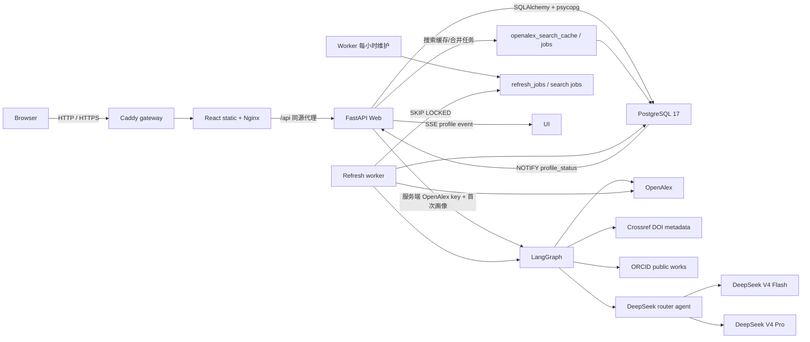

# 技术架构说明

## 总体结构

| 层 | 技术 | 责任 |
|----|------|------|
| 前端 | Vite + React + TypeScript | 身份确认、三栏画像、证据化对比、近期变化、登录、历史/研究追踪、SSE 与论文分页 |
| API | FastAPI | 密码登录、Cookie 会话、受保护查询、NDJSON 与 SSE |
| 工作流 | LangGraph | OpenAlex 发现、Crossref 核验、数据裁决、模型路由、多个学术分析 Agent、确定性证据审查和载荷格式化 |
| Repository | SQLAlchemy 2 + psycopg | 事务化事实数据、画像、加密用户凭据、持久搜索缓存、按用户额度状态和队列 |
| 数据库 | 标准 PostgreSQL 17 | 数据、约束、索引、通知和并发队列 |
| Worker | 独立 Python 进程 | 定时入队、刷新、质量检查、重试和清理 |
| 公网入口 | Caddy + Nginx | 自动 HTTPS、静态资源、同源 API 代理和日志 |

匿名前端先展示 Hero 搜索、原创科研插画、三项核心能力和数据可信说明，不自动打开登录框。`LandingHero` 只编排现有搜索状态，不新增匿名 API：匿名搜索把姓名保存在 `App` 组件状态并打开可关闭的认证弹窗；注册或登录成功后直接执行该姓名，关闭则取消本次动作但保留输入。后端查询路由没有开放匿名权限。

全局视觉变量集中在 `src/index.css`，暖黑/米白主题共同使用低饱和青绿语义色；`Button`、`Card`、`Tabs` 等基础组件负责圆角、边框、焦点和阴影一致性，业务组件不保存独立主题状态。首屏的明暗两套插画均以压缩 JPEG 随前端构建发布，不从第三方站点热链；React 只根据全局主题切换可见图层，CSS 负责淡入、轨道和浮动动画，并通过 `prefers-reduced-motion` 关闭非必要动态效果。`I18nProvider` 同步维护根元素 `lang`，CSS 据此选择中文与英文的字体和响应式排版。管理员看板作为应用一级内容视图渲染，不再以覆盖业务页面的固定定位层实现。

前端将文章详情、查询历史和研究追踪作为同一类响应式侧栏：`lg` 及以上进入页面网格的独立列，主内容同步收缩；较窄视口改为带遮罩的抽屉，手机宽度占满屏幕。面板使用动态视口高度和内部滚动，长标题、机构名和论文信息允许换行，避免水平溢出。

画像主内容按“学者概览 / 学术成果 / 合作关系 / 研究脉络”四栏组织。概览先展示研究画像，再把研究方向与核心指标合并呈现，随后展示近期变化、时间线和折叠的数据说明；学术成果包含代表论文与全部论文；合作关系包含核心合作者和关系图；研究脉络包含阶段、方向变化、方向活跃度和摘要演进。时间线方向点击会切换到学术成果并应用对应筛选。

候选选择页不渲染后端身份聚类的内部术语、分组分数、档案指纹或重复证据框，只使用机构、ORCID、研究方向、论文、引用、h-index 和最近发表年份帮助用户选择。后台仍保留完整 `identity_evidence`、`match_reasons` 与身份分组用于排序、审计和工作流校验。

`DataVerification` 不再渲染 Agent 名称、模型或降级状态；主层只显示收录论文、更新时间、数据来源和可能遗漏，Crossref 覆盖、来源差异和已知局限置于折叠说明。模型运行信息继续保存在 `agentAnalysis` 中供服务端审计，不作为学术结论展示。

`affiliation_evidence.py` 把 OpenAlex 作者 `affiliations` 和目标 author ID 的论文 `raw_affiliation_strings` 保留为内部身份核验证据。`select_primary_affiliation` 依次按最近六年覆盖年份数、最近关联年份、全职业覆盖年份数排序。该模块不解析或生成任职、院系、实验室、职称、学位或培养阶段；概览只展示独立来源核验的任职/教育、公共标识和分析依据，不再重复渲染 OpenAlex 机构历史与论文署名原文。底层 JSON 继续供身份裁决和审计使用。

合作摘要保留 coauthor OpenAlex ID；网络上方姓名按钮和图节点只打开合作者详情侧栏，侧栏中的“查询画像”按钮才调用画像加载函数，避免浏览图谱时意外切换当前学者。主学者姓名打开 OpenAlex，合作边打开共同论文侧栏。画像主体由 `ProfileSection` 和 `ScholarIntroduction` 负责，语言组装、身份事实与页面编排分离。

时间线方向标签把 `{year, topic}` 传给论文栏；React 在栏内容挂载后再滚动，避免切换时引用尚不存在。`GET /api/authors/{author_id}/works` 使用可选 `year`、`topic` 参数精确筛选 `raw_json.analysis_topics`。研究图谱 upsert 以 JSONB 合并更新 `raw_json`，不得覆盖画像分析主题、来源裁决和核验元数据。代码内 `analysisVersion=2` 让旧画像在访问时返回可用内容并幂等排队后台重算，不批量消耗外部额度；更新期间方向按钮禁用并显示说明。

学者对比由前端编排现有搜索与流式画像接口：当前画像作为基准，用户搜索并确认第二个 OpenAlex 实体后调用 `POST /api/profile/stream` 获取当次数据。比较指标完全从两份同结构画像派生，不新增独立缓存或统计口径；研究方向、时间线、代表作、论文与引用、影响力、合作者和近期变化模块逐项显示事实或计算口径。桌面端并排展示，窄屏端纵向排列并在弹层内部滚动。

近期研究变化复用工作流 `analyze_evolution` 生成的 `interestTimeline` 和引用统计节点生成的 `yearlyTrend`。前端以最近有论文的年份作为结束点，构造连续两个三年窗口；论文数量按年度事实汇总，方向升降按各窗口主题关联次数占比计算，降低总发文量变化造成的误判。六年矩阵在手机端使用紧凑固定列，不产生页面级横向滚动。

候选搜索先为同名 OpenAlex 作者抽取最多 100 篇高被引论文的轻量身份指纹。身份裁决采用保守规则：ORCID 相同直接归并；不同 ORCID 默认隔离，不能再由共同机构或主题数量覆盖；缺少 ORCID 时仍需共同论文，或机构、合作者、主题的比例型组合证据。机构履历异常扩散的档案不参与上下文自动归并，避免污染档案在常见姓名中形成连锁误合并。聚类以高引用档案作为主 ID，不通过阈值的同名者保持独立。前端只提交聚类得到的 ID 集合，工作流会再次计算指纹并拒绝不属于主身份组的 ID，避免客户端强制合并任意学者。

搜索先规范化 Unicode、空白和大小写得到共享 `query_key`。Web 与 worker 优先读取服务器 `OPENALEX_API_KEY`，普通用户无需配置数据源密钥；历史个人 key 仅在服务端 key 缺失时兼容回退。新鲜 `openalex_search_cache` 直接返回；过期结果先返回旧值并把 `requested_by_user_id` 写入后台刷新，冷请求以 `openalex_search_jobs` 的活跃任务唯一索引合并，多 Web 实例只有一个请求或 worker 访问上游。OpenAlex 不可用、限流或平台剩余额度到达保留线时，Repository 可按学者名/别名从已发布的真实 PostgreSQL 学者数据构造保守候选；没有本地事实时才返回明确上游错误。`openalex_identity_cache` 让不同姓名查询复用昂贵的论文/合作者/主题指纹，但不改变既有归并阈值。

多来源工作流先保留 `source_works` 原始记录：OpenAlex 负责发现，Crossref 按 DOI 核验出版元数据，`orcid.py` 从公共 ORCID works 端点读取 DOI/标题/年份且不需要密钥。来源裁决后，`resolve_work_identity` 以 ORCID 命中和 Crossref 作者 ORCID为强锚点；论文簇只由 DOI、同题同年记录或稳定合作者建立强连接，机构用于主簇评分但不能单独产生传递连接，主题相似只用于分析。多个 ORCID 锚定的跨方向簇共同保留；无 ORCID 时按最近机构、稳定合作者、近期连续发表和簇规模选择主簇。

研究方向优先聚合 OpenAlex topics 与重复 keywords；标题 2–4 元短语必须至少出现在 3 篇论文中才可辅助候选。`topic_agent` 输出 2–8 词规范方向名，标题复制、高相似标题、宽泛标签或不可追溯结果均被 Pydantic 后置校验拒绝。`trajectory_agent` 消费两个三年窗口的方向数量/占比、双语方向说明和代表论文 ID/标题/年份，最多输出四条内容级洞察；未知方向、虚构论文、纯数字复述和无证据推断不能发布。前端只渲染服务端用真实论文对象回填的 `evidencePapers`。

模型输出不是事实来源。`review_evidence` 仍在载荷格式化前确定性检查指标可复算性、论文链接可追溯性和证据 ID；Agent 审查只能降低置信度或触发模板重建，不能批准确定性门禁拒绝的内容。`agentAnalysis` 只保存 Agent 名称、模型、层级、升级原因、状态、趋势结论和审查摘要，不保存 key、完整提示词或原始响应。`LLM_STRONG_DAILY_LIMIT` 为单进程 Pro 调用保护线；达到后自动降级 Flash。

## 数据模型

| 表 | 作用与关键约束 |
|----|----------------|
| `scholars` | 学者实体；`unique(source, source_author_id)`，不按姓名合并 |
| `scholar_aliases` | 中文、拼音和英文署名 |
| `institutions` | 机构实体；`unique(source, source_institution_id)` |
| `scholar_institutions` | 学者—机构多对多 |
| `works` | 全部论文；`unique(source, source_work_id)` |
| `work_external_ids` | DOI/OpenAlex/Crossref 稳定标识到规范论文的唯一映射 |
| `authorships` | 论文—作者事实、顺序和原始署名 |
| `research_topics`、`work_topics`、`scholar_topics` | 主题实体、论文—主题和学者—主题时间统计；关系唯一且记录来源/置信度 |
| `collaborations`、`collaboration_works` | 规范化作者对及共同论文；作者 UUID 排序保证同一合作只存一次 |
| `work_citations` | 引用边；未在本地图谱出现的被引论文保留 OpenAlex ID，后续增量可回连 |
| `paper_insights` | 仅基于摘要的抽取式问题、方法、贡献、方向关系和原句证据 |
| `timeline_events` | 论文、主题、合作和机构事件；`unique(scholar_id, event_key)` |
| `research_graph_sync_state` | 最近尝试/成功、水位、指纹、版本、warning 和错误 |
| `research_graph_refresh_jobs` | 单学者增量/重建任务；每个学者只允许一个活跃任务 |
| `scholar_profiles` | 每位学者一份最新成功 JSONB、warnings、工作流版本和数据指纹 |
| `profile_status` | 轻量状态、版本和更新时间 |
| `refresh_jobs` | 任务状态、次数、退避、原因、错误和请求用户 |
| `openalex_search_cache` | 规范化姓名的候选 JSONB、抓取时间和过期时间 |
| `openalex_identity_cache` | OpenAlex 作者身份指纹，按作者 ID 去重并独立设置 TTL |
| `openalex_search_jobs` | 冷搜索/过期搜索刷新队列；保存请求用户，同一 `query_key` 只允许一个活跃任务 |
| `upstream_rate_limits` | `openalex:server` 平台额度及兼容个人 provider 的恢复时间和最近响应状态 |
| `app_users` | 应用用户；规范化用户名唯一、scrypt 密码摘要、启停状态和 `user/admin/super_admin` 角色 |
| `analytics_visitors` | 随机访客令牌的 SHA-256 摘要、可选用户和最近活动时间；不保存原始 IP |
| `analytics_events` | 页面访问、搜索、画像查看和异常分类；只保留必要动作、用户/学者引用与非敏感元数据 |
| `user_api_credentials` | 用户上游凭据；Fernet 密文、末四位提示和验证时间，复合主键隔离用户/provider |
| `auth_login_attempts` | 登录结果、用户名、IP 和时间，用于短时限速与审计 |
| `auth_registration_attempts` | 注册结果、IP 和时间，用于公开注册防滥用 |
| `api_rate_limit_events` | 搜索与画像生成的账号、IP、动作和时间窗口计数 |
| `user_sessions` | 不透明会话 token 摘要、过期和撤销时间 |
| `user_history` | 用户私有访问历史，同一用户/学者合并次数 |
| `favorites` | 用户私有研究追踪；复合主键去重，并保存上次查看的画像版本、论文数和引用数基线 |

`backend/migrations/*.py` 是唯一结构来源。Alembic 使用数据库所有者账号，运行时使用固定受限角色 `scholar_app`。数据库仅位于服务端私网，不向浏览器开放；所有用户所有权检查由 FastAPI 完成。

## 画像读写流程

### 交互式查询

1. `POST /api/profile/stream` 先读取最近成功画像：已有画像立即以 NDJSON `result` 返回，超过阈值时只幂等排队；仅首次画像同步运行 LangGraph 并输出四阶段进度。
2. 对候选身份组再次验证；仅联合获取通过身份阈值的 OpenAlex 作者详情和论文，游标分页必须完整结束。
3. 对有 DOI 的论文查询 Crossref，并记录已核验、未找到、失败和核验上限。
4. 数据裁决节点按 DOI 合并来源，保留字段来源与冲突；身份节点再以 ORCID、机构和合作者裁定准确优先的主论文集。
5. 引用、细粒度方向、演化和合作节点只消费身份裁决后的论文集；总结生成后执行证据审查。
6. 质量检查比较 `works_count`、本次数量、上一成功数量和证据审查结果。
7. 同一事务写入学者、机构、论文、authorship、最新画像和数据指纹。
8. `profile_status.version + 1` 并设为 `ready`；触发器发送轻量 PostgreSQL 通知。

### 最近成功画像与后台更新

- PostgreSQL 只保留每位学者最近一次通过质量检查的画像，供质量对比、论文分页和自动换版使用。
- `POST /api/profile` 读取最近成功画像；前端候选确认统一使用 `/api/profile/stream`，已有画像走缓存结果、首次画像走工作流。
- `POST /api/authors/{author_id}/profile/refresh` 对任意已发布画像幂等插入 `manual_profile` 任务，完整重跑多来源和 Agent；同一学者只有一个活跃任务，当前成功画像继续可读。
- `profile_status` 的 queued/updating/failed 和版本发布均通过 LISTEN/NOTIFY 进入 SSE；同版本状态变化不再被过滤，前端只在更高版本 ready 后重新读取画像。
- 研究追踪学者使用 24 小时阈值；最近 30 天访问者使用 7 天阈值。
- 后台维护和用户打开过期画像都按阈值原子去重插入 `refresh_jobs`，同时保存请求用户用于审计；用户立即看到最近成功画像，不在 Web 请求内等待更新。
- 只有完整抓取成功才允许删除已消失的中心作者 authorship。
- 追踪列表把最新画像中的论文数、引用数与当前用户的 `favorites` 基线比较，并从当前画像的两个三年窗口确定性识别方向变化提示。用户加载到相应画像版本后调用 `/api/tracking/seen`，事务内更新自己的基线，不影响其他用户。
- `POST /api/tracking/{author_id}/refresh` 先通过会话确定用户，再验证该用户确实存在对应 `favorites` 记录和平台数据源配置；随后调用现有 `enqueue_refresh` 并写入 `requested_by_user_id`。数据库活跃任务唯一索引与 Repository 的 `on conflict do nothing` 共同防止重复排队，返回已有或新任务 ID。Web 请求不调用 LangGraph，worker 继续通过 `FOR UPDATE SKIP LOCKED` 领取任务。
- 新前端统一使用 `/api/tracking...`；旧 `/api/favorites...` 仅作为兼容别名保留，数据库表名和历史 migration 不改写。主画像和追踪侧栏在写操作成功后递增本地修订号并重新读取追踪 API，避免同一页面的两个入口显示相互矛盾的状态。

### 动态研究图谱

1. 用户打开“研究图谱”栏时，读取接口才检查图谱是否缺失、超过 7 天，或最近成功画像发布时间晚于图谱成功时间，并幂等插入 `research_graph_refresh_jobs`；普通画像访问不建图。人工刷新受既有画像额度限制，`force_rebuild` 只在上一轮失败后允许单学者全量读取。
2. worker 读取最近成功时间，普通更新使用向前重叠 30 天的 `from_publication_date`；该筛选和 `sort=publication_date` 可在 OpenAlex 免费计划运行，避免误用返回 `Plan upgrade required` 的 `from_updated_date`/`sort=updated_date`。首次和显式重建不带水位，但都只处理当前学者。
3. OpenAlex 作者与论文分页必须完整结束。任何页失败时不进入图谱内容事务；Crossref 失败只产生 warning，已经成功保存的 Crossref 标题、年份、期刊和类型不被 OpenAlex 回退值覆盖。
4. DOI 和 OpenAlex ID 先通过 `work_external_ids` 定位规范论文，再原子 upsert 署名、机构、主题、合作、引用、摘要理解和时间线。所有关系使用主键/唯一键去重。
5. `analysisVersion=2` 后，图谱只消费当前已发布画像的身份裁决后 Work ID；未进入主论文集的 OpenAlex 论文不会重新混入图谱。图谱更新合并 `works.raw_json`，保留论文栏的 `analysis_topics` 和来源核验元数据。
6. 摘要理解只抽取 OpenAlex 摘要原句；摘要缺失时 `based_on_abstract=false`，四个理解字段与证据数组为空。
7. 读取接口只有在 `last_success_at` 存在时才投影内容，论文查询必须连接 `paper_insights` 图谱标记，避免把普通画像论文冒充为首次失败图谱；后续失败仍返回最近成功内容。
8. 前端纯函数 view-model 按图谱批次中最多 1000 篇论文—主题关系计算最多五个研究阶段、相邻阶段方向迁移信号和主题强度矩阵；首屏先汇总论文数、年份范围、摘要证据、内部引用和画像身份风险，成功但无有效论文时给出明确空态。计算保持时间正序以保证“新进入/持续/退出”语义，展示层再统一按最新到最早排序。
9. 对象详情 API 只接受作者、论文、机构和主题 UUID，读取、刷新和对象详情全部经过登录依赖；刷新任务只使用服务器 key 或任务请求用户自己的加密凭据。

### Worker

Worker 使用 `FOR UPDATE SKIP LOCKED` 依次领取 `openalex_search_jobs`、`research_graph_refresh_jobs` 和 `refresh_jobs`，优先读取服务器 `OPENALEX_API_KEY`；仅在服务端 key 缺失时按 `requested_by_user_id` 解密兼容个人 key。搜索成功发布共享缓存；图谱只有完整上游批次才进入原子 upsert；画像仍须通过质量门槛。三类任务失败最多重试 3 次。每小时维护为追踪/近期访问用户与过期图谱排队，并使用 PostgreSQL advisory lock 避免多 worker 重复调度。

## 身份认证

1. `POST /api/auth/register` 校验用户名和密码，按来源 IP 限制每小时 10 次尝试，保存随机盐 scrypt 摘要。
2. 注册成功后自动创建会话；用户名冲突返回 409，不覆盖已有账号。
3. `POST /api/auth/login` 先按规范化用户名和请求 IP 检查 15 分钟失败次数，再以恒定路径校验密码。
4. 成功后生成高熵随机会话 token；浏览器收到 `HttpOnly`、`SameSite=Lax` Cookie，数据库只保存 SHA-256 摘要。
5. `require_user` 从会话摘要解析启用用户；搜索、画像、论文、SSE、历史和研究追踪接口全部依赖该检查。
6. 历史和研究追踪 Repository 查询同时限制 `user_id`，确保多用户数据隔离。
7. 退出时服务端撤销会话并清除 Cookie；管理员重置密码时撤销该用户已有会话。
8. 搜索和画像生成在 PostgreSQL 事务内按用户与 IP 消费额度，多 Web 实例共享同一限制。
9. 当前前端不展示个人 OpenAlex 设置；兼容的 `GET/PUT/DELETE /api/settings/openalex` 仍只操作当前会话用户，PUT 在生产环境继续要求 HTTPS，并在配置 `CREDENTIAL_ENCRYPTION_KEY` 后加密保存。
10. `require_admin` 只允许 `admin/super_admin` 访问统计；`require_super_admin` 只允许受保护的 `admin` 超级管理员修改其他账号角色。普通管理员不能转授权，超级管理员不能被网页撤销。

## 访问统计

- 前端首次载入调用匿名可用的 `POST /api/analytics/visit`；服务端生成 30 天随机 `HttpOnly` 访客 Cookie，数据库只保存摘要。
- API 中间件最多每分钟更新一次访客最近活动；近 5 分钟活动构成在线口径。登录会话按用户聚合并返回用户名、设备/浏览器会话数和最近动作，匿名会话仅返回访客摘要前缀、时间与动作计数。
- 搜索、画像查看、注册/登录结果、限流和服务异常写入分类事件；搜索事件额外保存用户提交的查询词，用于管理员查看最近查询明细，随统计事件在 30 天后清理。系统不保存密码、密钥、Cookie、原始异常堆栈或运营统计 IP。
- `GET /api/admin/dashboard` 在 PostgreSQL 聚合 24 小时、7 天或 30 天趋势、在线用户与匿名访客明细，并返回最多 50 条近期访问、注册、搜索和画像查看记录；`GET/PATCH /api/admin/users` 只向超级管理员开放。
- 维护任务删除 30 天前的统计事件和长期未活动访客，不影响用户、画像、历史、追踪或研究图谱记录。

系统提供公开本地账号注册，但不依赖外部身份提供商。建议前后端同域部署，以简化 Cookie 和 CSRF 边界；生产环境必须启用 HTTPS 与 Secure Cookie。

## 进度与错误边界

- NDJSON 仍由既有 LangGraph 节点驱动，但 API 只向前端暴露四个稳定阶段：`verify_identity`、`aggregate_outputs`、`analyze_trajectory`、`verify_evidence`，并附带稳定 `message_code`；前端按当前语言翻译阶段、进度和错误，不直接显示后端中文文案。
- 搜索使用 30 秒总超时；同一冷查询最多等待共享任务 25 秒，超时返回可重试 503。画像流在 120 秒没有收到任何数据时判定为空闲超时。网络、超时、429、401、数据源未配置和工作流/worker 失败分别映射为独立前端状态。OpenAlex 客户端显式接收服务端 key，在重试耗尽后保留上游状态码和 `Retry-After`，但不会把 key 写入异常；每次上游响应把平台额度写入 PostgreSQL，达到保留线后阻止新的上游请求并优先返回缓存。
- 外部数据错误仍通过流式 `error` 事件结束；搜索与流式画像共享当前请求序号，全部论文分页及 SSE 触发的最新版读取也使用 `AbortController`，前端不会把中断或旧请求结果覆盖到新选择的学者。
- 追踪/历史和全部论文面板分别提供 loading、empty、error 与 retry 状态；错误态不会同时渲染为空态。

## 实时更新

`profile_status` 的 INSERT/UPDATE 触发 `pg_notify('profile_status', ...)`。FastAPI 内部持有一个共享 `LISTEN` 连接，把事件分发到订阅该学者的 SSE 客户端。前端仅在 `status=ready` 且新版本大于当前版本时重新请求画像；大型 JSONB 不进入通知载荷。

SSE 连接断开不会影响画像生成，浏览器重连后会先读取当前 `profile_status`，避免遗漏版本变化。

## 安全与权限

- PostgreSQL 不对公网开放；API 是唯一浏览器数据入口。
- 迁移撤销 `PUBLIC` 对 schema、表和 sequence 的默认权限。
- `scholar_app` 只用于 Web/worker，不能建表；迁移账号不提供给运行时。
- 密码与会话 token 均不明文入库；注册按 IP 限速，登录按用户名和 IP 限速，会话具有过期和撤销状态。
- 服务端 OpenAlex key 只通过 `OPENALEX_API_KEY` 注入 Web/worker，不写入数据库、前端、API 响应、日志或异常。只有启用兼容个人 key 写接口时才需要稳定的 44 字符 `CREDENTIAL_ENCRYPTION_KEY`。
- 生产环境的凭据写接口拒绝公网 HTTP 并返回 426；仅开发环境和回环主机允许 HTTP 测试。正式用户提交 key 前必须启用 HTTPS。
- 搜索与画像生成设置独立账号/IP 限额，事件由 worker 定期清理。
- 管理员入口显隐仅用于界面体验，真正权限由 FastAPI 角色依赖执行；运营统计不保存原始 IP，也不向管理员暴露会话 token、Cookie 或安全限速明细。
- CORS 仅允许配置的前端域名，Cookie 请求启用 credentials。
- 数据库、OpenAlex、可选凭据加密 key 和 LLM 密钥全部为服务端配置，不进入 Vite bundle。

## 部署模型

仓库提供两种兼容部署方式：

1. **单机 Compose（当前交付）**：Caddy、Nginx 前端、Web、worker、迁移、自动备份和 PostgreSQL 运行在一台 ECS。公网只暴露 Caddy 的 80/443，数据库端口仅绑定回环地址。`deploy/bootstrap-aliyun.sh` 可为 Ubuntu 24.04 ECS 安装 Docker、配置可选 ACR 加速、补充 Swap 和生成首次配置；`deploy/deploy.sh` 负责配置校验、迁移和健康等待，并根据上次成功提交到当前提交的 Git 变化选择前端增量、后端增量、纯文档跳过或完整构建。首次运行、`.env` 摘要变化和无法安全分类的基础设施变化自动执行完整构建。
2. **ECS + RDS（容量增长后）**：Caddy/Nginx、Web、worker 部署在 ECS，PostgreSQL 使用同 VPC 的 RDS。部署流水线先以迁移账号执行 Alembic，再启动受限账号的运行时服务。

无论采用哪种方式，公网只暴露 80/443；生产必须使用 HTTPS、安全 Cookie、独立备份和恢复演练。
