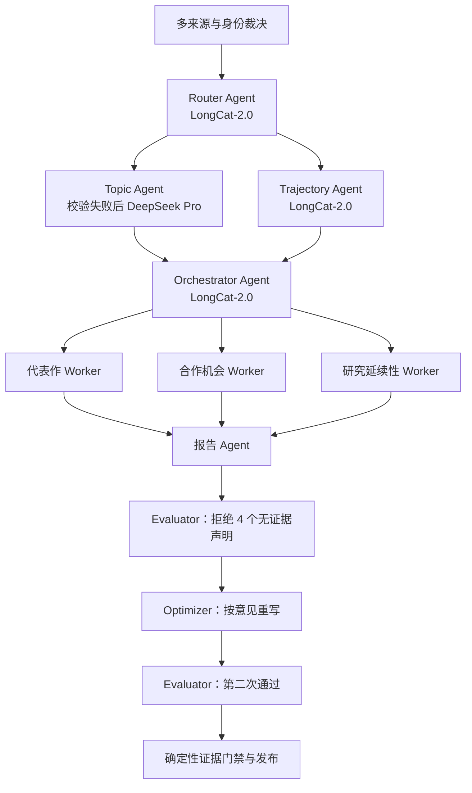

# Kaiming He 线上工作流透明测试

## 测试摘要

- 测试时间：2026-07-30 23:11–23:15（Asia/Shanghai）
- 线上环境：已脱敏的生产等价环境（不记录公网地址）
- 输入作者：Kaiming He，OpenAlex `A5100700361`
- 总耗时：`224.488s`（约 3 分 44 秒）
- 节点执行：`27/27` 成功，失败节点 `0`
- 并行任务：协调 Agent 动态创建 3 个 Worker
- 审查循环：首次审查拒绝，Optimizer 修改后第二次审查通过
- 脱敏原始报告：
  - 本机：临时脱敏输出文件（不记录本地路径）
  - 服务器：临时脱敏输出文件（不记录服务器路径）

报告只保存状态摘要、数量、模型、耗时和少量公开论文样本，不保存 API Key、密码、Token、完整提示词或模型原始响应。

## 逐步输入输出

| # | 节点 | 作用 | 主要输入 | 主要输出 | 耗时 |
|---:|---|---|---|---|---:|
| 1 | `fetch_profile` | 获取目标作者档案 | OpenAlex Author ID | Kaiming He、ORCID、预期 164 篇、1 个机构记录 | 1.144s |
| 2 | `collect_orcid_identity` | 读取 ORCID 公共论文锚点 | 作者 ORCID | ORCID 可访问，但返回论文数 0 | 2.926s |
| 3 | `collect_works` | 分页获取 OpenAlex 论文 | 作者档案 | 163 篇；样本包含 ResNet、Faster R-CNN | 3.289s |
| 4 | `dedup_works` | DOI/题名年份去重 | 163 篇原始论文 | 合并 1 条重复记录，保留 162 篇 | 0.000s |
| 5 | `collect_crossref` | 按 DOI 核验出版元数据 | 151 个 DOI | 核验 77、缺失 60、失败 14 | 33.697s |
| 6 | `collect_dblp` | 用 DBLP 核对计算机论文 | 姓名、机构、ORCID、已有论文 | 匹配 155 篇 | 1.210s |
| 7 | `collect_google_scholar` | 可选 Scholar 交叉核验 | 已有论文 | SerpApi 未配置，状态 `disabled`，未请求外网 | 0.003s |
| 8 | `adjudicate_sources` | 合并来源并裁决字段冲突 | OpenAlex 163、Crossref 77、DBLP 155 | 裁决集 162；多来源覆盖 156；8 个字段冲突 | 0.044s |
| 9 | `resolve_work_identity` | 排除疑似同名混入论文 | 裁决后 162 篇、ORCID/合作者/机构证据 | ORCID 锚定保留 124 篇，排除 38 篇、10 个冲突簇 | 0.010s |
| 10 | `plan_agents` | 选择模型层级 | 124 篇、17 年、身份风险、来源冲突 | LongCat 路由判定方向/轨迹/总结/审查均用 strong | 6.286s |
| 11 | `analyze_citations` | 确定性计算影响指标 | 124 篇身份裁决后论文 | 549,214 次引用、h-index 82、17 年趋势 | 0.006s |
| 12 | `agent_analyze_topics` | 生成细粒度研究方向 | 论文题名、topics、keywords、代表论文 | 3 个方向；LongCat 结果触发“标题式方向”校验，回退 DeepSeek Pro | 84.794s |
| 13 | `analyze_evolution` | 按年份构建方向时间线 | 124 篇论文、3 个方向 | 10 个年度方向事件 | 0.000s |
| 14 | `agent_analyze_trajectory` | 解读两个时间窗口的研究变化 | 方向占比、代表论文、年份窗口 | 3 条洞察，置信度 medium；LongCat strong | 21.906s |
| 15 | `analyze_coauthors` | 统计合作关系 | 身份裁决后论文署名 | 30 位合作者 | 0.002s |
| 16 | `build_graph` | 生成合作网络 | 合作者与共同论文 | 21 个节点、20 条边 | 0.000s |
| 17 | `orchestrate_workers` | 动态拆分专业分析任务 | 指标、方向、代表作、合作与 7 条证据 | 代表作、合作机会、研究延续性 3 个任务；未创建机构任务 | 6.790s |
| 18 | `analysis_worker` | 分析研究延续性 | 轨迹和 4 条关联证据 | medium 置信度结论；LongCat strong | 9.754s |
| 19 | `analysis_worker` | 分析合作机会 | 合作者和 1 条关联证据 | high 置信度结论；LongCat strong | 10.612s |
| 20 | `analysis_worker` | 分析代表作 | 代表论文和 5 条关联证据 | high 置信度结论；LongCat strong | 17.223s |
| 21 | `aggregate_workers` | 汇总并行 Worker | 3 个 Worker 输出 | 3 条专业分析全部完成 | 0.000s |
| 22 | `generate_report` | 生成双语画像总结 | 指标、方向、轨迹、Worker 结论和 7 条证据 | LongCat strong 生成中英文总结 | 13.078s |
| 23 | `agent_review_report` | 第一次证据审查 | 总结、引用 ID、证据与轨迹 | 拒绝：4 个问题，包括合作者数量、总引用和轨迹证据不足 | 7.167s |
| 24 | `optimize_report` | 按审查意见重写 | 原总结、4 个 flags、可用证据 | LongCat strong 完成第 1 次修订 | 9.372s |
| 25 | `agent_review_report` | 第二次证据审查 | 修订总结与证据 | 通过；6 条证据获批，high 置信度，0 个 flags | 15.525s |
| 26 | `review_evidence` | 确定性发布门禁 | 最终总结、7 条证据、Agent 审查 | 7 条证据全部可追溯，允许发布；总体置信度 medium | 0.002s |
| 27 | `format_payload` | 组装前端载荷 | 全部画像状态 | 124 篇、3 个方向、15 位前端合作者、完整 Agent 分析 | 0.001s |

节点耗时相加为 `244.841s`，大于墙钟时间 `224.488s`，因为三个专业 Worker 存在并行执行。

## Agent 协作情况

本次证明以下机制真实运行，而不是只存在于代码结构中：

1. **模型路由**：LongCat 优先；方向输出触发标题式标签校验后，使用 DeepSeek Pro 完成有效输出。
2. **Orchestrator–Workers**：协调 Agent 根据证据只创建 3 个适用任务，没有机械执行全部 Worker。
3. **并行分析**：三个 Worker 分别处理代表作、合作机会和研究延续性。
4. **Evaluator–Optimizer**：首次审查明确拒绝 4 个无证据声明，Optimizer 修改后重新审查并通过。
5. **确定性门禁**：最终发布仍要求引用 ID、指标和论文证据可复算。

## 发现的问题与能力边界

### P0：机构事实错误仍能通过审查

画像把主要机构写成 `Guangdong Academy of Medical Sciences`，但 MIT 官方页面显示 Kaiming He 于 2024 年加入 MIT EECS，当前为 MIT Associate Professor；个人主页还显示其兼职 Google DeepMind。

- [MIT School of Engineering](https://engineering.mit.edu/people/kaiming-he)
- [MIT CSAIL](https://www.csail.mit.edu/person/kaiming-he)
- [Kaiming He 个人主页](https://people.csail.mit.edu/kaiming/)

原因是当前证据审查主要检查“总结是否忠实引用系统内部证据”，无法判断上游作者档案中的机构是否属于错误记录。换言之，**流程通过不等于外部事实正确**。

建议把“当前核心单位”从论文关联机构中拆出，优先使用学者主页、学校主页等权威网页核验；无法核实时只显示“论文关联机构”，不生成当前任职结论。

### P1：身份净化有效，但召回率需要人工评估

身份节点从 162 篇中排除 38 篇，说明冲突簇过滤真实生效；但只命中 2 篇 ORCID 强锚论文，公共 ORCID works 接口本次返回 0 篇。需要进一步检查被排除的 38 篇中是否包含 Kaiming He 的真实成果。

### P1：研究时间窗口可能滞后

轨迹 Agent 使用的最新窗口为 2020–2022，而该学者 2024 年后仍有公开研究活动。可能原因包括近期论文未进入当前 OpenAlex 档案、近期论文在身份净化时被排除，或源数据更新时间不足。

### P1：外部核验覆盖不完整

- Crossref 151 个 DOI 中只核验 77 个，14 个请求失败；该节点耗时 33.697 秒。
- DBLP 覆盖较好，匹配 155 篇。
- Google Scholar 因未配置 SerpApi，当前没有参与核验。

### P2：主要性能瓶颈

1. Topic Agent：84.794 秒，占总时间约 37.8%。
2. Crossref：33.697 秒，占总时间约 15.0%。
3. Trajectory Agent：21.906 秒。
4. 最慢 Worker：17.223 秒；三个 Worker 并行后只承担最长路径时间。
5. 报告生成与两轮审查/优化合计约 45.145 秒。

## 结论

本次线上测试说明多数据源、动态 Worker、模型回退和 Evaluator–Optimizer 已真实介入画像生成，且能够阻止一部分无证据的 LLM 声明发布。当前最重要的缺口不是 Agent 是否运行，而是**上游身份和当前机构事实的权威核验**：内部证据一致性已经较强，但外部事实真实性仍需增加独立来源和冲突门禁。
